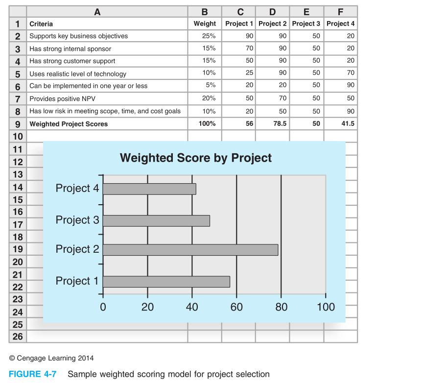
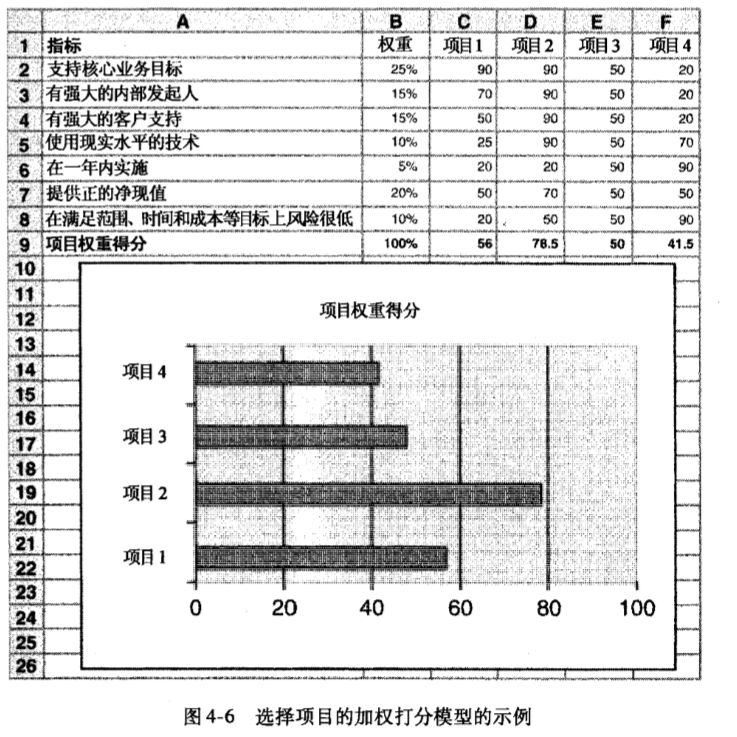
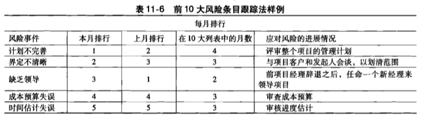
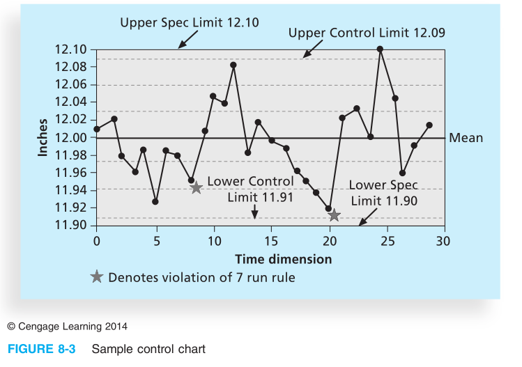
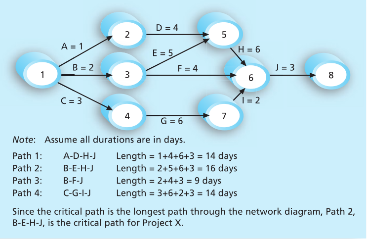
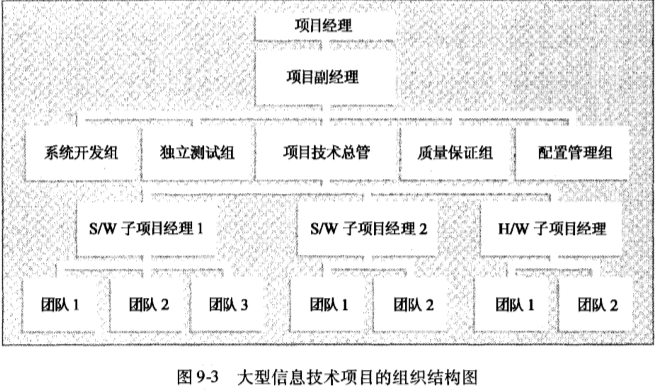
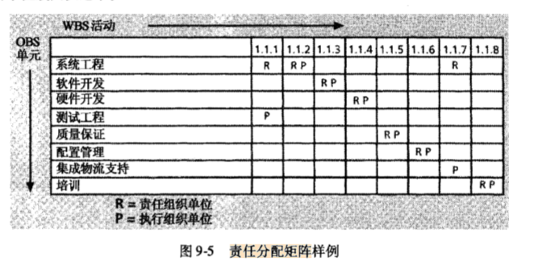
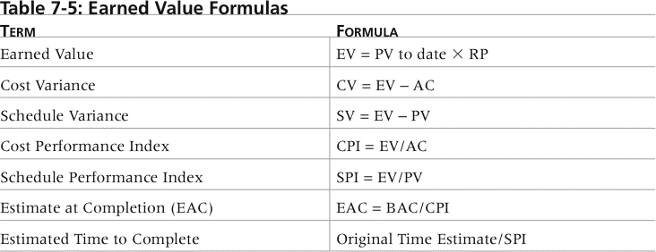
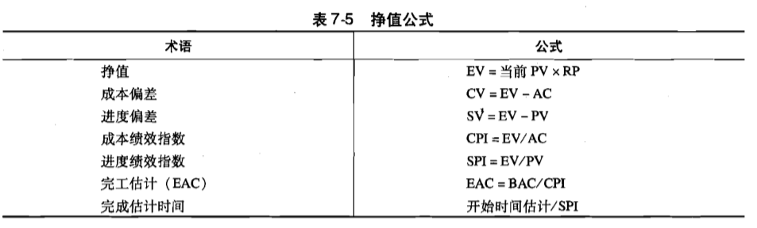
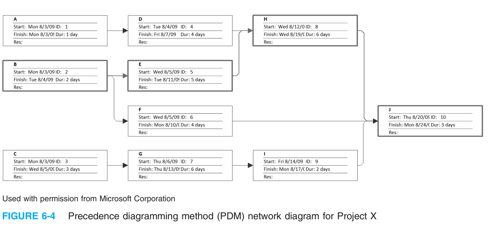

# 17级考点

PMP 160道选择题题库：http://nutek-us.com/PMP_SampleQA3.pdf

***

## 选择

### 1.项目的几个基本概念

Project, Project management, Project stakeholder, Project charter, Risk, Program

* **项目**：A project is a temporary endeavor undertaken to create a unique product, service, or result 项目是为创造一个特定的产品、服务或者成果而采取的临时性的努力
  * 项目的四个阶段：定义、开发、实施和收尾
  * 项目的五个过程组（针对每一个里程碑、子活动都要有这样的过程）：启动，计划，实施，监控，收尾
* **项目管理**：Project management is “the application of knowledge, skills, tools and techniques to project activities to meet project requirements”将知识域、技能、工具和技术应用于项目活动以实现项目需求
  * 项目管理三大约束：范围 进度 成本
* **项目干系人**：Stakeholders are the people involved in or affected by project activities
  * Stakeholders include:
  * The project sponsor（项目投资人最重要）
  * The project manager
  * The project team
  * Support staff
  * Customers
  * Users
  * Suppliers
  * Opponents to the project
* **项目章程**：document that formally authorizes a project
  * basically including name,key schedule milestones, Project Objectives, Budget Information,Main Project Success Criteria and so on
  * no deliverable description
* **project scope**：
  - Project scope is the part of project planning that involves determining and documenting a list of specific project goals, deliverables, features, functions, tasks, deadlines, and ultimately costs. 
  - In other words, it is what needs to be achieved and the work that must be done to deliver a project.
* **project success**：
  (1) the project has reached the target of scope, time and cost.
  (2) the project satisfies the client / project sponsor.
  (3) The results of the project have reached the main target
  (1) 项目达到了范围、时间和成本目标。
  (2) 项目使客户/项目发起人感到满意。
  (3) 项目的结果达到了主要目标
* **Risk：**
  The likelihood that a project will fail to meet its objectives.
* **Program**
  A program is a group of related projects managed in a coordinated way
* **IT 项目的例子：**
  * A technician replaces ten laptops for a small department
  * A small software development team adds a new feature to an internal software application for the finance department
  * A college campus upgrades its technology infrastructure to provide wireless Internet access across the whole campus
  * A cross-functional task force in a company decides what Voice-over-Internet-Protocol (VoIP) system to purchase and how it will be implemented
* **IT项目管理的趋势the development trend of ITPM（IT Project Management）**：中文P48
  - **全球化Globalization**: lower trade and political barriers and the digital revolution have made it possible to interact almost instantaneously with billions of other people across the planet
  - **外包Outsourcing**: **outsourcing** is when an organization acquires goods and/or sources from an outside source; **offshoring** is sometimes used to describe outsourcing from another country
  - **虚拟团队Virtual teams**: a **virtual team** is a group of individuals who work across time and space using communication technologies

-----------

### 2. 范围管理 WBS 启动会议 

work breakdown structure(WBS), kick-off meeting, responsibility assignment matrix(RAM).

* **WBS**：是对项目所涉及工作面向交付成果的分组
  * a deliverable-oriented breakdown of a project into smaller components
  * The Work Breakdown Structure is a principle output and should be broken down to a level which allows sufficient accuracy in planning.
* **WBS dictionary** 是一个描述WBS每项条目详细信息的文件
* **Kick-off meeting**（启动会议）：the first meeting with the project team and the client of the project. This meeting would follow definition of the base elements for the project and other project planning activities.

***

### 3. 综合管理 变更控制 NPV ROI IRR 直接成本  加权评分模型

- **<u>change control(变更控制)</u>**

  - **变更流程：**

    - Influencing the factors that create changes to ensure that changes are beneficial

      控制可能造成变更的因素，确保变更是有益的

    - Determining that a change has occurred确认发生变更

    - Managing actual changes as they occur管理实际变更

  - **变更控制系统(change control  system)** 是一个正式的、文档式的过程，**描述了正式的项目文件可能改变的时间和方式**。它还说明了有权可以作出变更的人员、变更所需的文档工作和其他项目会用到的自动或手动的跟踪系统。变更控制系统通常包含一个**变更控制委员会(CCB)、配置管理和变更沟通程序**。

    - 变更控制委员会（change control board,CCB）	

      负责批准或否决项目变更的团队。

    - **配置管理(configurationmanagement)** 确保了项目产品的描述是正确而且完备的。这项工作包括识别和控制产品和其支持性文档在功能和物理上的设计特性。

    - 配置管理中完整的变更处置流程：
      （1）变更申请。应记录变更的提出人，日期，申请变更的内容等信息。
      （2）变更评估。对变更的影响范围，严重程度，经济和技术可行性进行系统分析。
      （3）变更决策。由具有相应权限的人员或机构决定是否实施变更。
      （4）变更实施。由管理者指定的工作人员在受控状态下实施变更。
      （5）变更验证。有配置管理人员或受到变更影响的人对变更结果进行评价确定变更结果和预期是否相符，相关内容是否进行了更新，工作产物是否符合版本管理的要求
      （6）沟通存档。将变更后的内容通知可能会受到影响的人员，并将变更记录汇总归档。如提出的变更在决策时被否决，其初始记录也应予以保存。

- **net present value(NPV)**, Return on Investment(ROI)，internal rate of return(IRR内部收益率), Earned Value Management.

* $$
  NPV = \Sigma_{t=0...n} \frac{A_t}{(1+r)^t}
  $$

  ​													**r是折现率，t是年数，A是每年现金流数目**

* 
  $$
  ROI = \frac{Discounted Benefits -Discounted Costs}{Discounted Costs}=\frac{NPV}{折现成本}
  $$
  
* **internal rate of return(IRR)**：
  Internal rate of return (IRR) can be calculated by finding the discount rate（折现率） that makes the NPV equal to zero	
  
* **加权评分模型Weighted Scoring Model**：是一种基于多种标准进行项目选择的系统方法
  
  可选用的准则如下：
  
  - 支持核心的业务目标
  - 有极具实力的内部发起人
  - 有很强的客户支持
  - 运用符合实际的技术
  - 可以在1年或更短的时间内得以实施
  - 提供挣得净现值
  - 在低风险水平下满足范围、时间和成本目标
  - 中文P111
  - 
  - 
  
  - **Top management commitment crucial for project managers**
    - 高层支持对项目经理之所以如此重要，原因如下: 
      - 项目经理需要获取足够的资源。扼杀一个项目最好的方法就是不给它提供需要的资金、人员、 其他资源和成功的希望。
      - 项目经理经常需要及时获得项目特殊需要的审批。
      - 项目经理必须与来自组织其他部门的人员进行合作。
      - 项目经理经常需要他人在领导事务上给予适当的指导和帮助。
  

---

### 4. 风险管理 SWOT分析 预期货币值 十大风险条目跟踪 灵敏度分析 蒙特卡罗方法

SWOT Analysis与头脑风暴中的德尔菲都属于风险识别

* **SWOT 分析**：strength weakness opportunities and Threats
  
  * 优势 弱势 机会 威胁
  
* **Delphi Technique德尔菲技术**：德尔菲法就是一种可以防止头脑风暴法中出现的一些负面群体效应的信息采集方法。中文P326
  
  * **德尔菲法 (Delphi Technique)** 的基本含义是用于在专家团体中达成一致意见的方法，从而对将来的发展作出预测。
  * 这种方法是在 20 世纪 60 年代晚期由兰德公司为美国空军首创的，是一种在对未来事件的预测进行独立且匿名地输入信息的情况下，系统性的、交互性的**预测方法**。德尔菲法通过重复多次的提问和回答，其中包括对前一轮的反馈，来利用群体的输入信息，而避免了在小组口头讨论中可能产生偏见 的情况。使用德尔菲法时，你必须**挑选一组擅长某个领域的专家**。例如"开篇案例"里的柯利福·布兰奇，他就可以用德尔菲法来帮助找出公司生意不再像过去那样红火的原因。柯利福可先召集一组他所在业务领域的专家。每名专家要回答与柯利福遇到的情况相关的问题，然后他或者主持人将评价他们的回答，得出一些意见和判断，接着在下一轮把这些反馈给每位专家。柯利福将继续重复这个过程，直到大家的回答都集中于某个特定的方案。如果回答还有分歧，这个德尔菲法的主持人就要确定一下是否过程中出现了什么问题。
  
* **Expected monetary value(EMV预期货币值)**
  
  - 考虑风险事件概率及其货币价值的产物
  - 本质即计算期望（成功概率 × 成功收入 - 失败概率 × 失败损失）
  
* **前十大风险条目跟踪top ten risk item tracking**：
  Top Ten Risk Item Tracking is a qualitative risk analysis tool that helps to identify risks and maintain an awareness of risks throughout the life of a project.（from google)(示例在中文课本P331，英文课本P460)
  
* **灵敏度分析Sensitivity Analysis:**
  - 用来表述改变一个或多个变量对结果产生影响的一种技术。 
  - 也就是用控制变量法分析成本、收入等问题。
  - 
  
* **蒙特卡洛分析（Monte Carlo analysis)**

  * 蒙特卡洛分析法 (Monte Carlo analysis) 通过多次模拟模型的结果来为所计算的结果提供统计分布.蒙特卡洛法能确定一个项目将在某一日期完 成的概率只有 10% ，还可以确定项目将在另外一个日期完成的概率有 50% 。换句话说，蒙特卡洛分析法能预测在某二日期完成的概率，或是成本等于或少于某个值的概率。 

  * 具体使用示例：

    1. 估计所考虑变量的范围。也就是说，为模型中的变量找到最有可能性、最乐观和最悲观的估计。
    2. 确定每个变量的概率分布。变量落在最乐观和最大可能估计值之间的概率是多少?如8周（乐观）    和10周（最可能）之间完成的概率可能是20%
    3. 为每个变量，如一个任务的时间估计，根据变量发生的概率分布选择一个随机的值。如用上例，则该值在8-10周的概率为20%。
    4. 利用每个变量所选值的组合进行一次确定性分析，或贯穿整个模型的分析
    5. 多次重复步骤 (3) 和 (4) ，以获得模型结果的概率分布。

    - 图例如下：
    - 

---

### 5. 质量管理 因果图 帕累托图 七点运行法则 质量保证 CMMI

Cause-and-Effect Diagrams,  Pareto Charts, The Seven Run Rule,Delphi Technique, fishbone diagram,Project Quality, Quality assurance..

* **质量：**“the totality of characteristics of an entity that bear on its ability to satisfy stated or implied needs” (ISO8042:1994) or
  “the degree to which a set of inherent characteristics fulfils requirements” (ISO9000:2000)
  
* **项目质量管理project quality management**：

* is to ensure that the project will satisfy the needs for which it was undertaken.
  
  * 质量管理的目的是为了保证项目能够满足它应满足的要求
  * **project quality including:** 
    * functionality, system output, performance, reliability, maintainability 
    * 功能性,系统输出,性能,可靠性,可维护性
  
* **质量保证quality assurance**：包括满足一个项目相应质量标准的所有相关活动。

* 质量保证的另一个目标是不断改进质量
  
  * 英语定义：Quality assurance includes all of the activities related to satisfying the relevant quality standards for a project. Another goal of quality  assurance is continuous quality improvement. 
  * **因果图Cause-and-Effect Diagrams**：是将关于质量问题的抱怨追溯至<u>负有责任的生产环节</u>的图。也被称为**鱼骨图** 中文P229
  * 如图所示：
  
  
  
  
  
* **帕累托图Pareto Chart**：

  * A Pareto chart is a histogram that can help you identify and prioritize problem areas. The variables described by the histogram are ordered by frequency of occurrence. 
  * **Pareto charts help you identify the vital few contributors that account for most quality problems in a system.	**
  * 帕累托图是直方图

  

* 控制图（control chart）
  
  * **七点运行法则（seven run rule）**：
    * 如果质量控制图（见下图）上连续的7个数据点都在平均值以下、都在平均值以上，或者所有点都出现上升或下降趋势，那么需要检查这个过程是否有非随机问题
    * **注** *控制图（control chart）：是数据的图形表示，表明一个过程随时间变化的结果*
  * 
  
  
  
* 检查表（checksheet）
  
* 散点图（scatterdiagram）

* 流程图（flowchart），运行图（runchart）

* **能力成熟度模型集成Capability Maturity Model Integration(CMMI):**
  
  * a process improvement approach that provides organizations with the essential elements of effective processes. It can be used to guide process improvement across a project, a division, or an entire organization. CMMI helps integrate traditionally separate organizational functions, set process improvement goals and priorities, provide guidance for quality processes, and provide a point of reference for appraising current processes.
  * 一种为组织的有效过程 提供基本要素的过程改进方法。它可用于指导一个项目、一个部门或整个组织中 的过程改进。 CMMI 有助于集成传统上分离的组织功能，设定过程改进目标和优先顺序，提供质量过 程指导，为评估现有的过程提供一个参考点。
  * **CMMI 的能力层次为**: 
    0. 不完整级（Incomplete）:在这一层次，不是没有实施过程，就是只是部分实施了过程。在这一层次不存在通 用的目标，也没有达到过程域的一个或多个特定目标。 
    1. 已执行级（Performed）:己实施的过程实现了过程域的特定目标和提供了支持，使所有需要开展的王作都能产生工作成果。尽管这一能力层次使某些内容得到改进，但是如果不能将其制度化,这些改进一段时间后就会消失。 
    2. 受管理级（Managed）:在这一层次，一个过程会有合适的基础架构来支持。这一过程是根据政策来规划和执行的，并聘用了有经验的员工。这些员工有足够的资源产生控制的输出。这一层次反映出的过程纪律，能够保证现行的做法在持续的压力中仍然能够保持下去。 
    3. 已定义级（Defined）:在此成熟层次，过程被严格地进行了定义。一个项目的标准、过程描述及程序已从组织的系列标准过程中分离出来，以适应这一特殊项目。 
    4. 定量管理级（Quantitatively managed）:在此层次，对过程使用统计及其他定量技术来加以控制。组织设立了质量和过程绩效的定量目标，用作管理过程的标准。 
    5. 持续优化级（Optimizing）:一个最优的过程是基于对过程内在偏差的一般原因的理解而得到改进的。重点是通过递增的和革新的改善，持续扩大过程绩效的范围
       课本P184 

### 6. 进度管理 浮动时间

- **schedule control suggestions**
  - Perform reality checks on schedules
  - Allow for contingencies
  - Don’t plan for everyone to work at 100% capacity all the time
  - Hold progress meetings with stakeholders and be clear and honest in communicating schedule issues
  - 按计划执行现实检查 
  - 考虑到突发事件 
  - 不要计划让所有人始终以100％的产能工作 
  - 与利益相关者举行进度会议，并在沟通进度问题时保持清醒和诚实

- **活动 Activity（task）**
  工作要素之一，常在工作分解结构上看到，它往往有预期持续时间和成本，预期资源需求，同时也有一定的任务。

- **活动排序**

  * 依赖关系：
    * 强制依赖关系（mandatory dependencies）
    * 自由依赖关系（ discretionary dependencies）
    * 外部依赖关系( external dependencies)

- **网络图Network Diagram**

  - 是项目活动之间的逻辑关系或者顺序的示意性的表示
  - **网络图类型：**
    - **双代号网络图AOA Activity-On-Arrow**
    - **箭线图法ADM Arrow Diagramming Method**
    - **前导图法PDM Precedence Diagramming Method**
  - **任务依赖关系**：
    - FS: A finish then B can start
    - SS: A start then B can start
    - FF: A finish then B can finish
    - SF: A start then B can finish

- **PERT计划评审技术**：Program Evaluation and Review Technique

- **三点估计Three-point Estimates（估算活动资源）：**

  - Instead of providing activity estimates as a discrete number, such as four weeks, it’s often helpful to create a **three-point estimate**

    - estimate that includes an optimistic, most likely, and pessimistic estimate, such as three weeks for the optimistic, four weeks for the most likely, and five weeks for the pessimistic estimate

  - Three-point estimates are needed for **PERT** and Monte Carlo simulations

  - 计算方法：
  $$
    PERT\ weighted\ average = \frac{optimistic\_time+4\times most\_likely\_time+pessimistic\_time}{6}
  $$
  

    - $$
      =\frac{乐观时间+4\times 最可能时间+悲观时间}{6}		
      $$

      
    
      - Example:
      
      $$
      PERT\ weighted\ average = \frac{8\ workdays + 4 \times 10\ workdays + 24\ workdays }{6}  = \bold{12\ days}
      $$
    
      where *optimistic time = 8 days, most likely time = **10 days**, and pessimistic time = 24 days*
    
      Therefore, you’d use **12 days** on the network diagram instead of 10 when using PERT for the above example

- **关键路径：过程中活动时间最长**

  - 在关键路径上要时间
  - 在非关键路径上要资源
  - **Critical Path Method (CPM)**
    - **CPM** is a network diagramming technique used to predict total project duration
    -   A **critical path** for a project is the series of activities that determines the *earliest time* by which the project can be completed
    - The critical path is the *longest path* through the network diagram and has the least amount of slack or float
    - **Slack** or **float** is the amount of time an activity may be delayed without delaying a succeeding activity or the project finish date
    - 如下图所示为网络图及关键路径
  - **自由浮动时间free slack**(free float)自由时差：
    the amount of time an activity can be delayed without delaying the early start date of any immediately following activities.一个活动在不延误紧接活动的最早开始时间（early start date）的情况下可以被延误的时间
  - 计算公式：

  $$
  FF=min\{ES_{紧后工作}\}-EF
  $$

- **总时差total slack**(total float)：
  the amount of time an activity can be delayed from its early start date without delaying the planned project finish date.一个活动从它最早开始时间起，在没有拖延计划项目完成日期的情况下可以被耽搁的时间。

  - 计算公式：
    $$
    TF = LF-EF=LS-ES
    $$
    

### 7. 人力资源管理

* **Maslow's Hierarchy of Needs model**

  * 马斯洛需求：生理、安全、社交、尊重、自我实现

    ​					   Physiological,safety,social,esteem,self-Actualization
  
* **塔克曼模型Tuckman model**：描述了团队建设（team development）的5个阶段：
  1. **形成阶段 Forming** 该阶段包括成员的引进，发生再项目组的初始期或当新成员被引进时。这个阶段是必要的，但实际完成工作很少
  2. **震荡阶段 Storming** 这个阶段发生再团队成员对项目组应如何运作上具有不同观点的时期。人们彼此之间相互试探，内部常常伴有冲突
  3. **规范阶段 Norming** 这一阶段形成在当团队成员形成了一种通用的工作方法，而且合作与协作取代前一阶段的冲突与不信任时。
  4. **执行阶段 Performing** 该阶段发生在强调团队成员目标的达成而不是团队的工作过程的时候。关系固定，团队成员更可能建立彼此之间的忠诚。在这个阶段，项目组能够管理较为复杂的任务和处理更大的变更。
  5. **终止阶段Adjourning** 该阶段包括项目组成功达到目标和完成工作后团队的解体。

* **组织分解结构,organizational breakdown structure(OBS)**: 显示组织中各团队单位所负责的项目工作的一种特殊的组织结构图(organizational chart)。下图为组织结构图：

  * 
  * **组织结构包括职能型，项目型和矩阵型**
  * 

* **responsibility assignment matrix(RAM) 责任分配矩阵**：
  
  * maps the work of the project, as described in the WBS, to the people responsible for performing the work, as described in the OBS.
  * 

### 8. 成本管理 挣值管理

* **direct costs（直接成本）：**
  * Direct costs can be directly related to creating the products and services of the project.
  * 是与生产项目产品和服务直接相关的成本。你可以把直接成本直接归结到某一项目上去。例如，项目中全职工作的工人的工资和为项目专门购买的软硬件都是直接成本。项目经理应该关注直接成本，因为他们可以控制直接成本。 

* **挣值管理Earned Value Management**：是一种综合了项目范围、时间和成本数据的项目绩效测量技术

  挣值管理设计计算项目WBS中每项活动或概要活动的三个值：(易出计算题)

  * **计划值 (PV)** :它是按月分配的所有活动计划成本的积累量。注意，计划成本的曲线贯穿了整 个项目，结束于完工时的成本预算点。 
  
  * **实际费用 (AC)** :所有活动按月实际花费量的积累。 

  * **挣值 (EV)** :按月计算的所有活动挣值的积累量。 
  
    ***其他概念：***
  
  * **成本偏差 (cost variance, CV)** 是用挣值减去实际费用。如果成本偏差是一个负数，那意味着完成 工作的花费比原计划的要多。如果成本偏差是正的，那意味着完成工作的花费比原计划的少。 
  * **进度偏差 (schedule variance, SV) 是**用挣值减去计划值。负的进度偏差意味着完成工作花费了比 原计划更多的时间，而正的进度偏差意味着完成工作花费的时间比原计划的少。 
  * **成本绩效指数( cost performance index, CPI)** 是挣值与实际费用的比率，可用来估计完成项目的 预计成本。如果成本绩效指数等于 1 ，那意味着成本和预算是一致的。如果成本绩效指数小于 1 或 100%，那项目到此就超出了预算。如果成本绩效指数大于 1 或 100% ，那项目到此的花费就低于预算。 
  * **进度绩效指数 (schedule performance index, SPI)** 是挣值与计划值的比，可用来估算预计完成项目 的时间。和成本绩效指数相似， SPI等于 1 或 100% 的进度绩效指数意味着工期与预期的一致。如果进 度绩效指数大于 1 或 100%，项目到此提前超前于预期。如果进度绩效指数小于 1 或 1∞%，说明项目 到此落后于预期。 
  * **完工预算 (budget at completion, BAC)**: 这个项目最初的总预算，或这个例子中的 100000 美 元。代表完工预算的点画在图中第 12 个月的上方，它是项目最初预计的完工时间。 
  * **完工估计 (EAC)** :在这个例子中估计为 122308 美元。这个数字是用 BAC (此例为 100000 美 元)除以 CPI (此例为 81. 761%) 计算得到的。代表 EAC 的点标记在图中 12. 74 个月的上方， 它是项目预计实际完成的时间。这个数字是用最初的时间估计(此例中为 12 个月)除以 SPI (此例为 94.203% )计算得到的。 
  * 注意，通常成本和进度偏差为负数意味着出现了问题，也意味着项目在计算挣值的这个时间点比 预期花费了更多的费用和时间。同样， CPI 和 SPI 小于 1 或 100% 也是如此。 成本绩效指数可以用来估算完工估计 (estimate at completion, EAC) 一一基于当前的绩效水平对 完成项目所做的成本估计。同样，进度绩效指数可以用来估算完成项目的时间。
  * 
  * 
  * 

### 9. 采购管理

* **自制/外购决策Make-or-Buy decision**：指组织决定实在组织内部制作某些产品或完成某种服务好，还是从组织外部购买这些产品或服务更加符合组织的最大利益见（采购管理procurement）
  * 中文书P348或英文书P483

### 

---

## 简答

* List and briefly describe the main processes involved in each project management knowledge areas(Include project stakeholder management)

|                        | 启动            | 计划                                                         | 执行                                              | 监控                             | 收尾        |
| ---------------------- | --------------- | ------------------------------------------------------------ | ------------------------------------------------- | -------------------------------- | ----------- |
| 成本Cost               |                 | 1. 成本管理  2. 成本估计  3. 确定预算                        |                                                   | 4.成本控制                       |             |
| 沟通Communication      |                 | 1. 沟通管理计划                                              | 2. 沟通管理                                       | 3. 沟通控制                      |             |
| 范围Scope              |                 | 1. 范围管理计划  2. 收集需求  3. 范围定义  4. 创建WBS        |                                                   | 5.确认范围  6. 控制范围          |             |
| 质量Quality            |                 | 1. 质量管理计划                                              | 2. 执行质量保证                                   | 3. 质量控制                      |             |
| 人力资源Human Resource |                 | 1.人力资源管理计划                                           | 2. 组件项目团队  3. 建设项目团队  4. 管理项目团队 |                                  |             |
| 集成Integration        | 1. 制定项目章程 | 2. 制定项目管理计划                                          | 3. 指导和管理项目                                 | 4. 监控项目工作  5. 综合变更控制 | 6. 项目收尾 |
| 采购Procurement        |                 | 1. 采购管理计划                                              | 2. 实施采购                                       | 3. 采购控制                      | 4. 采购收尾 |
| 风险Risk               |                 | 1. 风险管理计划  2. 风险识别  3. 定性风险分析  4. 定量风险分析  5. 风险响应计划 |                                                   | 6. 风险控制                      |             |
| 时间Time               |                 | 1. 进度管理计划  2. 活动定义（清单、属性、里程碑）  3. 活动排序  4. 活动资源估计  5. 活动工期估计  6. 生成进度表 |                                                   | 7. 进度控制                      |             |
| 干系人Stakeholder      | 1.识别干系人    | 2. 干系人管理计划                                            | 3. 干系人参与管理                                 | 4. 干系人参与控制                |             |

## 应该是大题

* Calculation for NPV and ROI
  - $$
    NPV = \Sigma_{t=0...n} \frac{A_t}{(1+r)^t}
    $$
  
    ​												*r是折现率，t是年数，A是每年现金流数目*
  
  - $$
    ROI = \frac{Discounted Benefits -Discounted Costs}{Discounted Costs}=\frac{NPV}{折现成本}
    $$
  
* Analyze project performance

* Manage project change（项目变更管理）

* Estimate project costs according to OBS and other information

  * 算工资和设备，可能类似如下两图（图片为基于WBS而不是OBS）

  * 

    

* Create the Project WBS, speed up the project schedule

## 16级师兄手抄卷题型及考点再整理

原试卷地址：https://github.com/shiwanghua/ToTheEndOfUniversityLife

***

一、名词解释 24‘ 6*4

1. ​	Scope Baseline

   - ​	The approved project scope statement and its associated WBS and WBS dictionary

   - ​	批准项目的范围说明以及和它相关的工作分解结构和工作分解结构字典。 

2. ​	Project

   - ​	A project is a temporary endeavor undertaken to create a unique product, service, or result

   - ​	项目是为创造一个特定的产品、服务或者成果而采取的临时性的努力

3. ​	CMMI

   - A process improvement approach that provides organizations with the essential elements of  effective processes
   - The capability levels of the CMMI are:
     - Incomplete,Performed,Managed,Defined,Quantitatively managed,Optimizing
   - 一种为组织的有效过程提供基本要素的过程改进方法。 
   - CMMI包括五个层次级别，不完整级，已执行级，受管理级，已定义级，定量管理级 ，持续优化级

4. ​	DMAIC

   - Define, Measure, Analyze, Improve, Control

     A systematic, closed-loop process for continued improvement that is scientific and fact based

   - 定义、衡量、分析、改进、控制 

     为持续改进而进行的以事实和科学为依据的系统循环过程。 

     是使用六西格玛进行质量控制的项目的常用过程。

二、填空题 26’

1. List and briefly describe the main process involved in project quality management.

   ​	类似的题基本必考喽，每年肯定不一样，都看看叭。

2. Resource Leveling Technique 资源平衡（具体题型看不清，贴个资源平衡的图大家熟悉一下）

   

3. Scrum图填空8个 （中文书52页图）

   

​		

三、计算题 35‘

 1. AOA PDM

    大概是网络图计算工期的样子（能想到的：最早开始时间，最晚开始时间，自由时差，总时差等）
    $$
    Free Float=min\{ES_{紧后工作}\}-EF
    $$

    $$
    TotalFloat = LF-EF=LS-ES
    $$

    附图

    

    

    ​																				*AOA*

    

    ​																				*PDM*

2.P209-211的公式

四、案例分析 15’

​		师兄没记下来（显然也记不下来，只能参考13年的样题）

***

## 名词解释补充

SMART 里程碑原则

Specific、Measurable、Assignable、Realistic、Time-framed

Gantt chart = bar chart

风险 

风险定性\定量分析（Risk  quantitative\qualitative analysis）

​	定性：	

​	概率影响矩阵（probability/impact matrix）

​	top-ten

​	定量：

​	决策树、模拟灵敏度分析

风险相应计划：

风险回避、风险承担、风险转移、风险缓解

avoidance\acceptance\transference\mitigation

risk appetite\tolerance\utility

​	risk-averse\seeking\neutral

