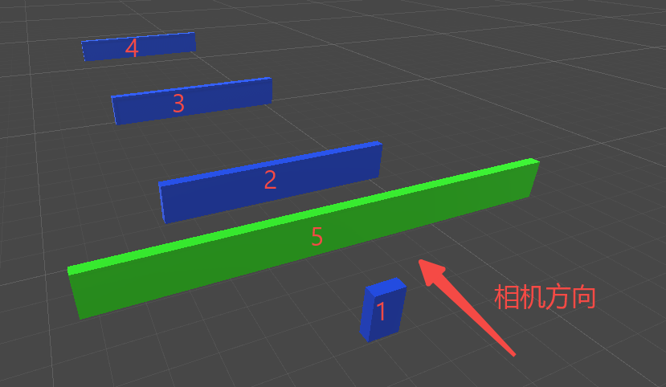
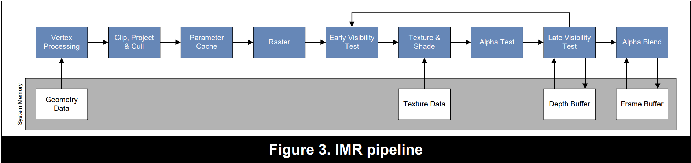
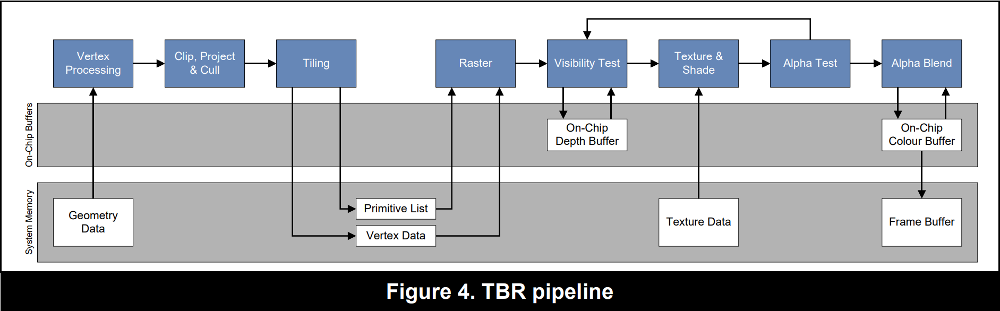
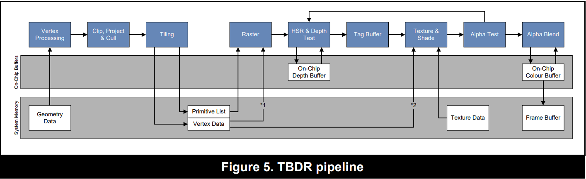

# 关于early-z与pre-z技术优化

关于early-Z与pre-z的概念可以参考[Pre-Z与Early-Z - 飞书云文档 (feishu.cn)](https://leiting.feishu.cn/docs/doccnE6dcLu3XHFWNh219s9Hy6f)

### 为什么强调"Early" Z

学习过图形学的同学应该都了解，为保证渲染顺序的正确性，渲染时通常有一个Z-buffer来记录顶点的深度信息。但是似乎令人费解的是，传统的做法中，去与z-buffer比较与抛弃片元这一操作是放在片元着色器器计算完成后进行的。这可能是出于片元着色器可能会改写深度——这种操作也就是打断earlyZ的元凶，所导致的不稳定性考虑的，但显然这种浪费是不可接受的，所以硬件商随后都提出了在计算片元着色器前，进行片元剔除的earlyZ优化。

### Early-Z的几种具体实现方法

首先不同厂商对于这种在渲染片元前，抛弃无用片元的操作有着不同的称呼，HSR（hidden surface removal),EarlyDT(Early Depth Test),事实上大家对这种抛弃操作的处理也都有一定的差异。

#### 1.传统的EarlyZ

最常见的EarlyZ方法是基于front to back的渲染顺序的，由于我们首先写入了最前面的深度，因此在之后做深度检测的时候就应当能根据已经写入的深度，抛弃所有在这之后的片元。

这种方法要求所有对象在传入GPU前就已经是有序的了，即CPU需要对所有对象进行排序。他会有一些缺点：

##### 1.CPU只能对对象进行排序，即几何级别的排序。因此当对象存在大量交叉现象时，部分片元无法享受到early-z的剔除效果。

##### 2.合批操作可能会导致early-Z的失效（或者强行由前往后排序导致合批失效）

可以假设一堆物体本来用的是同一个材质，但是位置上差异较大。

考虑合批减少drawcall的话，我们应该将这批数据的顶点一起发送给GPU，但如果考虑从前往后排序的话，我们可能需要先将更靠前的对象传给GPU以进行Early-Z剔除

如图所示，1234为同一材质，5为另一材质。

优先考虑合批，我们需要两次drawcall，第一次传入1234，第二次传入5，同时125都会进行几乎完整的片元着色器计算。

优先考虑Early-Z,我们需要至少3次drawcall，分别是{[1],[5],[2,3,4]}，但是只有15会进行几乎完整的片元着色器计算，234都会被剔除。

实际的场景通常更为复杂，因此我们一般优先考虑的依然是合批操作。Unity关于从前往后的排序也是在渲染排序中没有其他设置时才会进行的默认操作。

综上，传统的early-Z并不能做到完美的【只有最前面一层的片元被绘制，后面的片元都被剔除】这样程度的优化，具体的优化效果取决于对象的排列位置、CPU实际传入的对象排序等。

并且这种early-Z会被alpha-test等，在片元着色器中舍弃了片元/修改了片元深度的操作打断，因为early-z根据深度阻止了更靠后的顶点进入片元着色器步骤，而通过了early-Z的前方片元又可能在片元着色器被舍弃，这样在这一像素上可能就不会有任何正确的物体被绘制。因此一旦启用alpha-test，在完成片元着色器计算前，我们都不能舍弃片元，early-Z也就必须被打断。

*另外由于early-Z要求前向渲染，当镜头移动或者物体移动的时候，传入的渲染顺序就自然需要改变，而这会增大带宽（PowerVR如是说到，未验证）*

阻止early-Z被打断理论上有一种方法: 需要进行AlphaTest的物体不进行深度写入[[1]](https://stackoverflow.com/questions/17898738/early-z-test-depth-test-in-directx-11)。即可以认为Alphatest的物体不参与eraly-z的过程，被他们遮挡的第一层常规非透明物体被early-Z视为真正的最前面的对象，必定通过early-Z测试。这样子就可以保证至少有一个不会被剔除，且位于前方的像素会进到片元着色器，每个像素就必定能有一个可以绘制的点。

当然这也可能导致问题：由于没有写入深度，AlphaTest物体之间的遮挡关系也会丢失，因此依然无法保证渲染结果的正确性。这虽然也可以通过限定Alphatest的物体从后往前绘制的方法（画家算法）来进一步确保渲染结果的正确性，但这与early-Z本身的从前往后渲染又有冲突，而且画家算法本身也会产生几何级别物体的渲染结果错误现象。

综上，即使AlphaTest不进行深度写入，也无法保证early-Z就正常进行，同时由于Early-Z是硬件级别的优化，也只有在真机上测试才能判断结果。

#### 2.像素级别的early-Z（Pre-Z)

Pre-Z其实也是部分硬件实现early-Z的一种方法，实现方法也非常简单粗暴，就是整个场景多一个pass，这个preZ Pass(或者叫PreDepth Pass)只进行顶点变化和深度写入。由于深度已经在这个pass确定了，后续的片元就可以通过将Z-Test设为Equal来准确的挑选需要绘制的片元。

通过这个pass，就可以实现传统的early-Z没有实现的，精准的每个像素只绘制一个片元这样的操作，overdraw为0（至少正常绘制的pass中的overdraw为0）

这个缺点也非常明显：多一次场景渲染，就多一倍的drawcall，顶点翻倍，光栅化和深度测试。这些操作带来的消耗可能比省下来的片元着色器计算更为费时。因此只有在片元着色器进行了特别复杂的计算，如高级光照计算或复杂采样计算的时候，才可能带来实质性的优化。

如果只是单纯写入深度，那么Pre-Z只是单纯的像素级别的early-Z，显然P也无法避免受alpha-test等操作的影响，无法保证绘制正确的图案。

这里就有pre-Z的另一个用法了：如果在片元着色器中得知片元是否应该被舍弃的过程并没有那么复杂，我们可以将这一部分计算也加入到PreZ-pass中，事先进行clip/discard操作。这样就依然可以保证渲染的正确性。这也是我们本来想做的事情。但是如果判断片元是否需要舍弃/改写深度的操作已经非常复杂，那么这种优化又丧失了意义

#### 3.进一步优化的early-Z（HSR）

结合上面两种方法的缺点，我们可以将目标定为寻找一种，既不会增加drawcall，又可以实现像素级别的剔除的early-Z方法。基于TBR（tile Based Rendering),PowerVR在其文档中提出了一种近似的方法。

##### 移动端渲染流程

在讲这种特殊的early-z之前。先来简单介绍下移动平台常用的渲染流程TBR，在这之前还要先看下下传统的渲染IMR(Immediate Mode Rendering),此处引用的图片都是来自于PowerVR的介绍[PowerVR Hardware (imgtec.com)](http://cdn.imgtec.com/sdk-documentation/PowerVR+Hardware.Architecture+Overview+for+Developers.pdf)

传统渲染 IMR

传统的IMR非常好理解，就是每个对象都会完整的走完渲染流水线，之后下一个对象进入。渲染过程中对象所有的顶点、颜色、深度等信息都直接放在内存（显存）中使用。这里的early Visibility test就是前面提到过的，依赖于物体传入顺序来实现的。

但是移动端平台并没有足够的带宽和高速缓存来传输和记录这么多数据，所以硬件商就用了另一套管线，TBR

TBR

> By processing a tile at a time, the size of on-chip buffers can be finely tuned to the tile size. The graphics hardware can then use on-chip buffers for colour, depth and stencil buffer Read-Modify-Write  operations. This enables the hardware to avoid costly system memory transfer operations and, instead, use high speed on-chip memory.

可以看到，对象的顶点在经过裁剪和转换后，进行了一步tilling操作切割成很多块叫做tile的区域，记录下每个三角形归属于哪一块tile的信息并且把这些信息写入内存，之后再分tile进行光栅化等操作。由于每次只执行一个tile，就可以选择性的把这个tile内的数据放入高速缓存，以减少内存读写，降低带宽，更多利用高速缓存。大致思路如此，具体的可以参考[移动平台GPU硬件学习与理解 - 知乎 (zhihu.com)](https://zhuanlan.zhihu.com/p/347001411)这篇文章的3.2节。大部分移动gpu目前都是TBR的流水线。

而PowerVR还提出了一个叫TBDR（Tile Based Deferred Rendering）的东西

> Deferred rendering means that the architecture will defer all texturing and shading operations until all  objects that could be deferred, primarily opaque geometry, have been tested for visibility. The  efficiency of HSR is such that overdraw can be removed entirely for completely opaque renders. This  significantly reduces system memory bandwidth requirements.

在TBR的基础上，修改了VisibleTest变为HSR & Depth Test，添加了TagBuffer，以及很重要的，多了一条Vertex Data到Shader的路径。按照官方说法，他在TBR的基础上进一步延迟渲染的发生时机，直到所有对象都完成了可视性测试后，才进行真正的渲染。到这里，终于可以看到想要提及的别样的Early-Z了（虽然PowerVR管他叫HSR）

#### HSR

按照官方的说法，HSR是一种不会受到Alpha-Test等片元着色器内操作影响，做到了像素级的可视性检测，能够完全避免不透明对象overdraw的技术。很遗憾官方对HSR具体细节没有太多描述，只能结合给出的资料进行一些猜想。

首先HSR采用了延迟渲染的思路，把所有物体都进行了一波处理后才开始真的渲染，但是他并不是真的延迟渲染——这些操作并不是进行光照计算，而只是进行了深度测试。事实上TBR就对渲染进行了一次延迟，即先分配tile信息，再读取tile下对应的几何信息进行真正的渲染。TBDR不过是延迟时进行了更多的操作，用于之后的HSR。这个操作具体就是用射线检测tile中所有图元的位置，记录深度信息。

在所有图元都记录之后，tile才开始真正的渲染，这时候即使在渲染阶段发生了片元舍弃，顶点信息其实也还保留在前面的VetexData中，即存在缓存中，只要再捡回来就可以了。这个具体怎么捡回来的过程不得而知，但官方表示这是一个可以快速刷新的过程。这就保证了他不会被alphaTest等操作打断。而由于他是通过给tile内每个图元进行射线检测，得到的是像素级别的深度图，因此可以做到完全避免overdraw。

缺点也显而易见，延迟渲染理当需要更多的缓存，虽然powerVR表示他们只记录了最少的信息，TBR辛苦省下来的带宽又多少被加了一点负担

> To minimize data fetch, the ISP only  retrieves position information for geometry that is required to render the tile, with vertex and primitive  masks ensuring the smallest possible data set is retrieved.

PC端目前应该还没有使用类似的技术，HSR终究是依赖了TBR的tile划分和延迟处理，而TBR的效率其实是不如IMR的，只是节约带宽出的优化。

但是移动端很可能大家已经抄了过去，从对GPU为Adreno 650, Adreno 660的机子测试来看，他们的early-z似乎已经不受clip影响了。更多的GPU则还是有待测试。

参考资料

[PowerVR Hardware (imgtec.com)](http://cdn.imgtec.com/sdk-documentation/PowerVR+Hardware.Architecture+Overview+for+Developers.pdf)

[移动平台GPU硬件学习与理解 - 知乎 (zhihu.com)](https://zhuanlan.zhihu.com/p/347001411)

[optimization - Early Z-test / depth-test in DirectX 11 - Stack Overflow](https://stackoverflow.com/questions/17898738/early-z-test-depth-test-in-directx-11)

[深入剖析GPU Early Z优化 - 知乎 (zhihu.com)](https://zhuanlan.zhihu.com/p/53092784)

