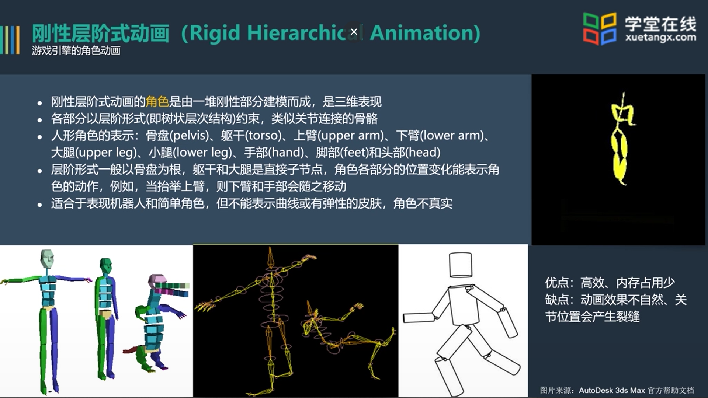
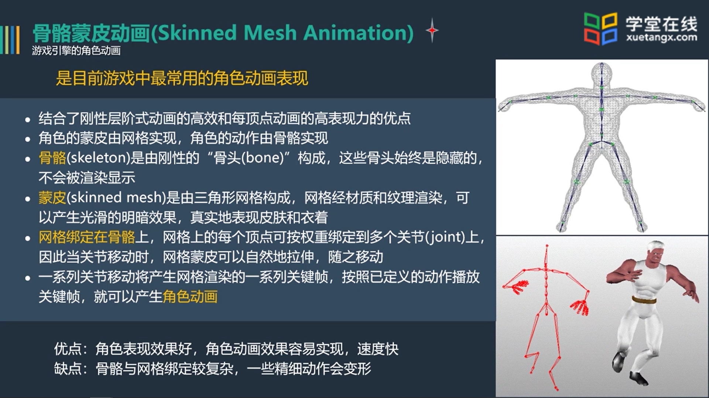
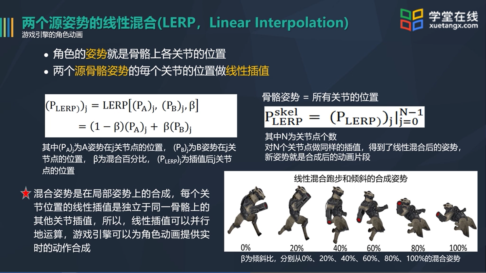
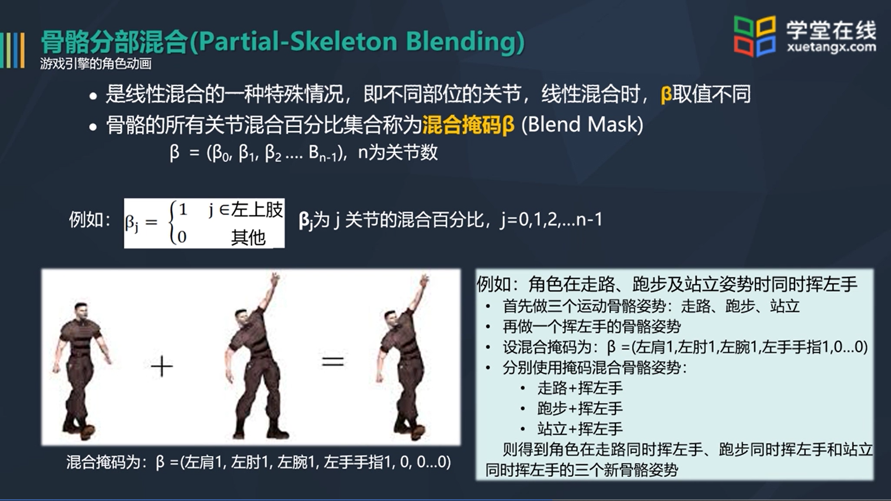
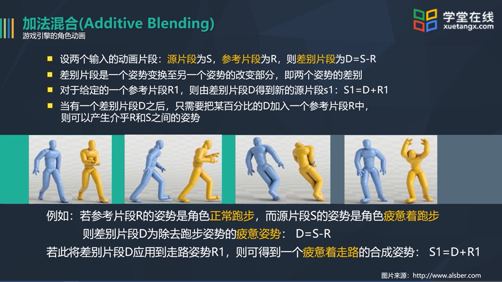
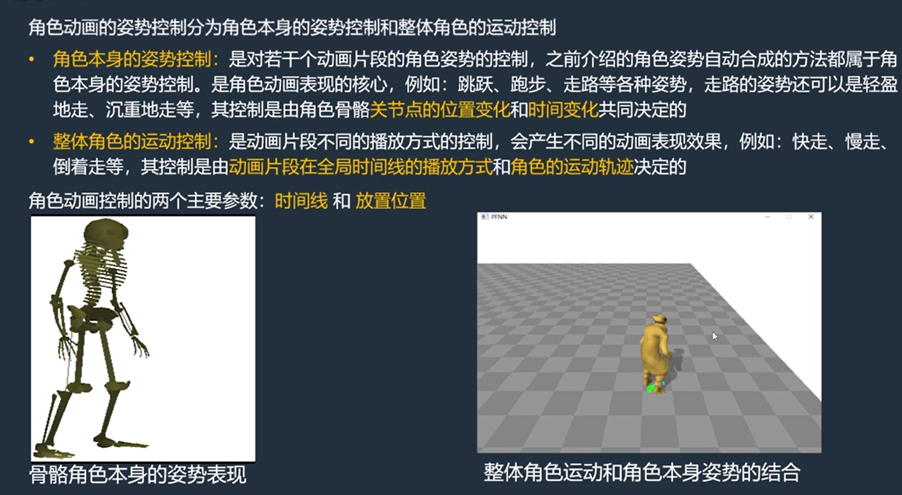
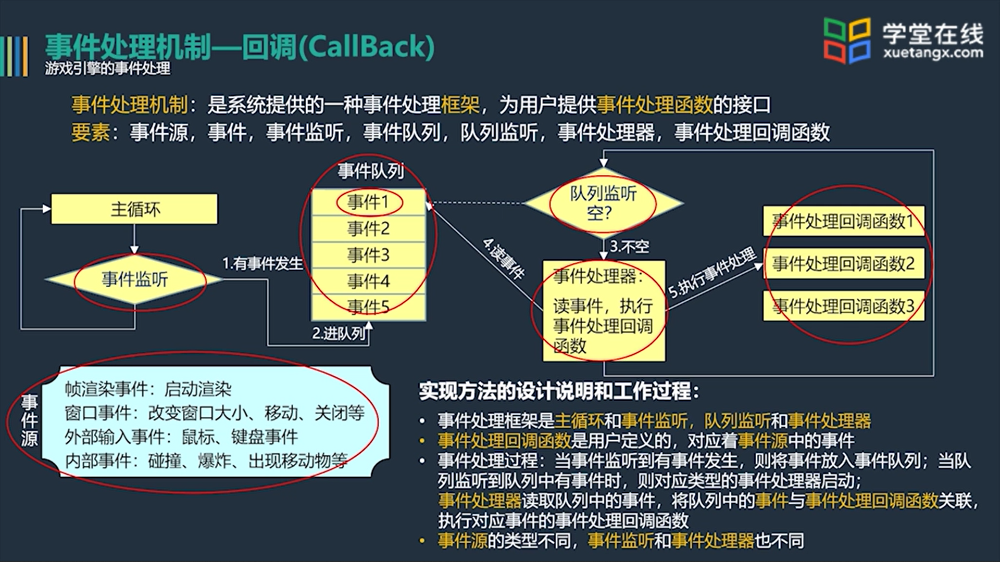
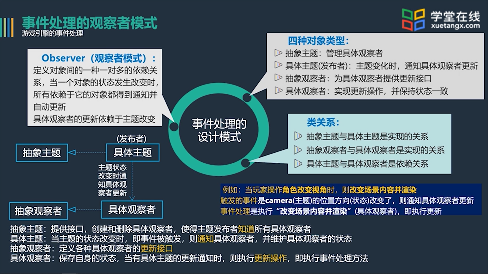

[toc]

# 3D游戏引擎设计[MOOC]

## 游戏引擎场景管理

### 八叉树场景管理

#### 概述

对于三维空间，使用立方体/长方体的结构，将其分为八个小立方体来进行管理

1.分割三维空间，把场景分成很多更小的部分，用层次树组织这些被分割的部分

2.八叉树就是把空间分成八等份，如果被分的部分填满了场景内容，或被分的部分没有场景内容，则不再分割；否则，继续分割，直到满足终止条件

3.被分割的空间可以用八叉树组织 

#### 分割八叉树算法

通过对结点区分为Empty和Full来记录结点，只有Full(F)的结点会被记录

#### 八叉树遍历方法

​	当镜头位置和方向确定后，场景的便利顺序就可以确定

​	渲染顺序可以由图形学的画家算法和Z-Buffer等方法进行

#### 优点：

1.由八叉树的分割算法可知，八叉树与BVH树一-样，具有包围体层次的特性，即顶层节点的立方体包含其所有子节点的立方体
2.八叉树方法适合于表示室外场景,当场景的局部在视见体里，只要判断哪些子立方体在视见体里即可,可以自顶向下分层判断

### BSP树算法

#### 概述

BSP树即Binary Space Partitioning，二叉空间分割。广泛用于第一人称视角类的游戏。

#### BSP树构建算法

##### 涉及的几何问题

**如何判断凸多面体**

暴力算法，对每个面根据定义进行判断

凸多面体定义：对于任意一个面，所有其他面都在该面的某一方向

**如何判断面片关系**

四种情况：前面，后面，相交，重叠

**如何判断顶点与面片的关系**

$Ax+By+Cz<>D$

##### 关键优点

​	在某个镜头下，对于凸多面体集，可以方便地判断哪些是可见面，哪些是要剔除的被遮挡面，因此可以快速地求出视见体中所有多边形面片遮挡关系，确定这些面片的渲染顺序，即BSP树的遍历路径。

​	这种处理方法类似于画家算法，即先确定视见体中面片的前后顺序，再从后向前或从前向后渲染。

#### 本节疑问

MINIMUMRELATION有什么用？什么时候会求不到最佳超平面？

## 本章作业疑问

场景中的可移动对象并非都可以被渲染？如何理解？

## 游戏引擎的资源管理

### 资源管理概述

**常见游戏资源：**

音频、视频、图片、模型、角色动画、字体、材质和纹理贴图等

**分类：**

用于场景的资源，用于游戏界面设计的资源、用于游戏整体效果的资源、配置引擎平台、资源或插件等的参数文件 

**主要任务**

资源管理：抽象并定义统一的资源处理方法，如：资源加载和卸载、资源调度等。

资源组织：根据各类资源的特性和使用方式，设计资源数据的内存组织。

**资源管理**

##### **文件管理**

文件加载与卸载、文件解析、文件格式转换、文件资源打包、文件资源传输

##### **内存管理**

内存分配、访问保证、内存释放

#####  **状态管理**

##### **调度算法**

##### **多线程处理**

### OGRE资源组织

#### OGRE资源组织概述

OGRE不支持菜单界面，需要第三方组件进行实现

OGRE主要是图形引擎，不包含声音、物理、AI、GUI等内容

#### **OGRE资源组织类及之间关系**

#### **Material脚本文件**

## 游戏引擎的场景渲染

### 场景渲染概述

Camera、Transformation等图形学相关概念

FrameBuffer，每一帧的计算结果缓存

FPS，帧率

#### 不可见物体剔除

主要包括视见体提出、被遮挡物体剔除、背面剔除

前两种可以用包围体剔除

剔除的目的是为了减少渲染面片的计算

- 不可见物体剔除计算本身是有代价的，不必精准判断
- 高性能的硬件可以加速物体的渲染计算

##### 剔除视见体之外的物体（View-frustum Culling)

用视见体的六个面分别裁剪物体的包围体 

##### 剔除视见体内的被遮挡物体( Occlusion Culling )

1.基于包围体判断视见体内物体的见后关系（八叉树结点与视点的位置关系）

2.射线追踪法判断物体平面与视点的距离，剔除被遮挡物体的三角形面片

3.深度缓存判断要渲染的三角形面片的前后关系

##### 背面剔除( Back-face Culling )

三角形背面向着摄像机就剔除

设: n为平面A的法向量，v为摄像机方向
则，当n.v<0时，平面A的正面对着摄像机
当n.v>0
时，平面A的背面对着摄像机

实时渲染过程

不可见物体剔除计算的权衡

## 游戏内的角色动画

### 游戏中的角色表示

#### 赛璐璐动画：

什么是赛璐璐:
赛璐璐是透明的、上面可以绘画的塑料片， 将多个赛璐璐放置于固定的手绘背景上，就能产生动画
电子的赛璐璐又称为精灵动画(Sprite Animation),精灵是指一-张细小的位图，将多个精灵叠放在一个背景图
片上，就能产生固定背景的动画
赛璐璐动画:
一组精灵位图循环显示，可以得到循环动画(Looping Animation)
.一个赛璐璐角色可以有多组动画，如闲置周期(idle cycle)、步行周期(walk cycle)和跑步周期(run cycle)等

赛璐璐技术在游戏中的应用:
游戏中的怪兽可以用BillBoard方式显示(假三维)，即Billboard 上贴纹理位图，产生动画
可用于低分辨率或远距离场景，例如体育馆里的观众背景、或战场上千军万马的军队背景等

#### 刚性层阶式动画（Rigid Hierarchical Animation)

#### 每顶点动画

动画师在每个顶点设计精细的动画，理论上可以实现任何动画，但计算量太大，实时游戏中很少使用

变形目标动画：部分区域的每顶点动画？

#### 骨骼蒙皮动画

#### 游戏角色动画的建模（骨骼蒙皮）

1.蒙皮(Skin): 建立角色的网格模型
2.骨骼(Skeleton): 建立关节和关节层次树,并将关节与对应的网格顶点绑定
3.皮肤或衣服(Skin or Clothes):定义网格的材质和纹理贴图
4.角色动画:描述角色的动作，定义角色骨骼的位置移动

### 骨骼蒙皮动画

#### 自由度（DOF，Degree Of Freedom):确定连接结构的独立参数的个数

1个自由度:杆件A仅绕Y轴旋转，即杆件A的端点P只能在球面的一个圆上移动
2个自由度:杆件A绕Y轴和Z轴旋转，即端点P能在球面上移动
3个自由度:杆件A绕Y轴、Z轴和自身旋转，即端点P能在球面上移动，且杆件A可以自扭转
**6个自由度:除了有三个旋转自由度，杆件A可以在三个轴方向平移**

###   角色动画的合成技术

#### 线性混合

##### 骨骼分部混合

#### 加法混合

### 角色动画的运动控制

  

局部时间线和全局时间线

整体角色的运动控制与播放时间和角色的防止位置有关

### 动画系统的组织架构

多数动画系统有3个层次:
1.动画管道:有一个或多个动画片段及对应的混合因子作为输入，再产生一个局部骨骼姿势作为输出。也会为骨骼计算一个全局姿势，以及生成蒙皮矩阵调色板供渲染引擎使用
2.动作状态机(ASM, Act State Machine) :位于动画管道之上，ASM可以确保角色从一个状态圆滑地过渡到另一状态
3.动画控制器:是更高级的角色控制功能，每个控制器可以特别建立管理某个角色行为的模式

## 引擎的事件处理

### 游戏循环架构风格

#### 回调驱动框架的交互控制方式

在基于框架的游戏引擎中，游戏循环已经建立，游戏程序员"填充”框架中的游戏内容，如场景定义、游戏逻辑、件处理方法等，其中事件处理是通过**回调函数(CallBack Function)**执行的

##### 回调

##### 基于事件更新的交互控制方式

##### 视窗消息泵的交互控制方式

消息泵是先处理来自windows的消息，无消息时才执行引擎内部的事件处理机制

#### 事件处理的观察者模式

## 引擎的内存管理与可拓展实现

### 内存管理

#### 内存管理概念

引擎的内存管理：

各种树结构数据内存的分配和释放（队列、映射、树、对象工厂、容器）

数据访问操作

CPU访问的主内存管理、GPU……

 