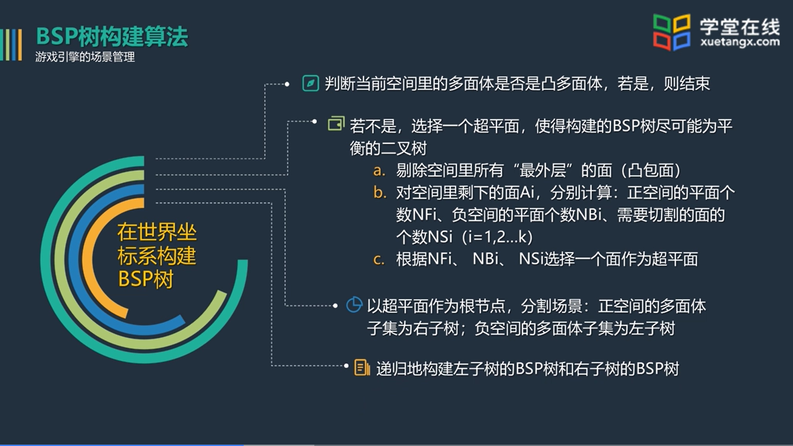
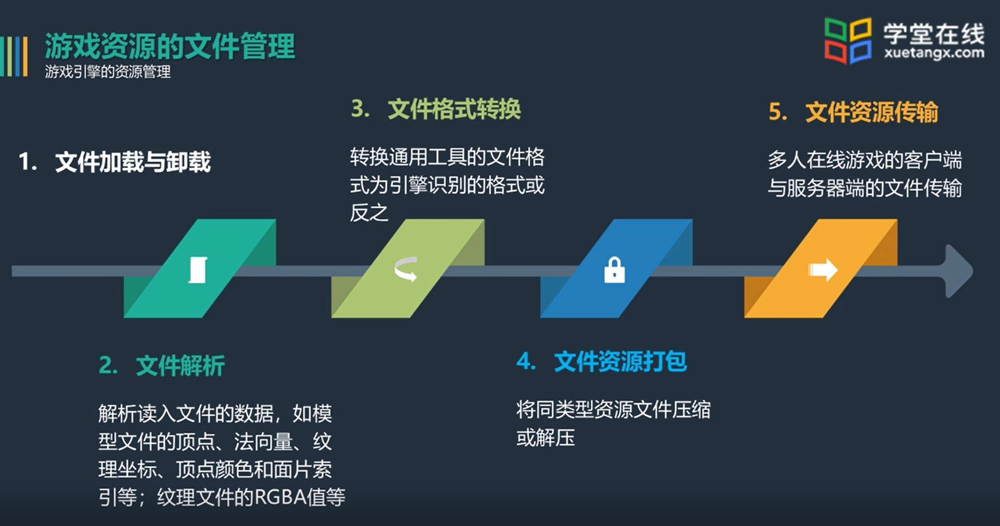
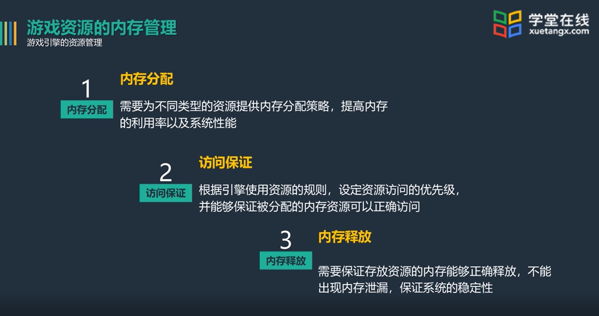
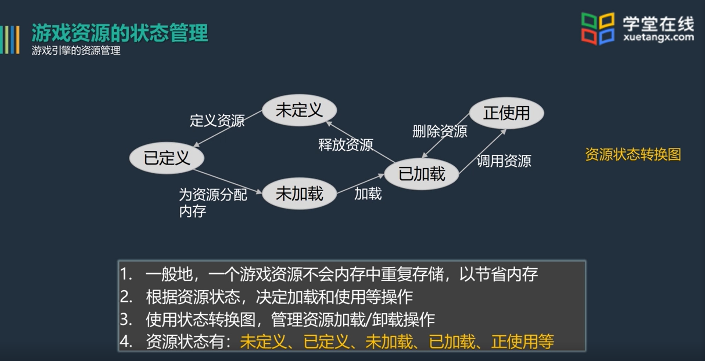
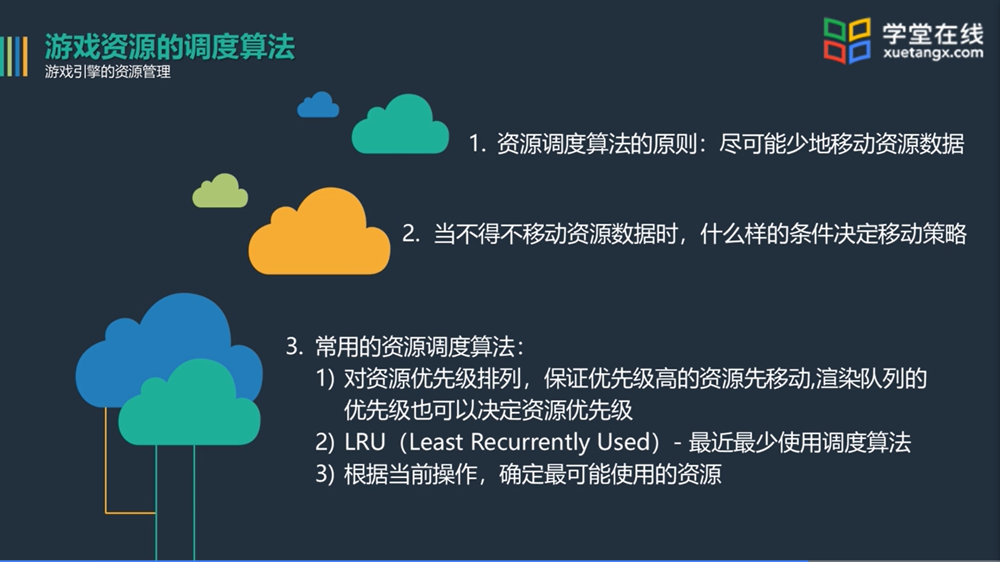
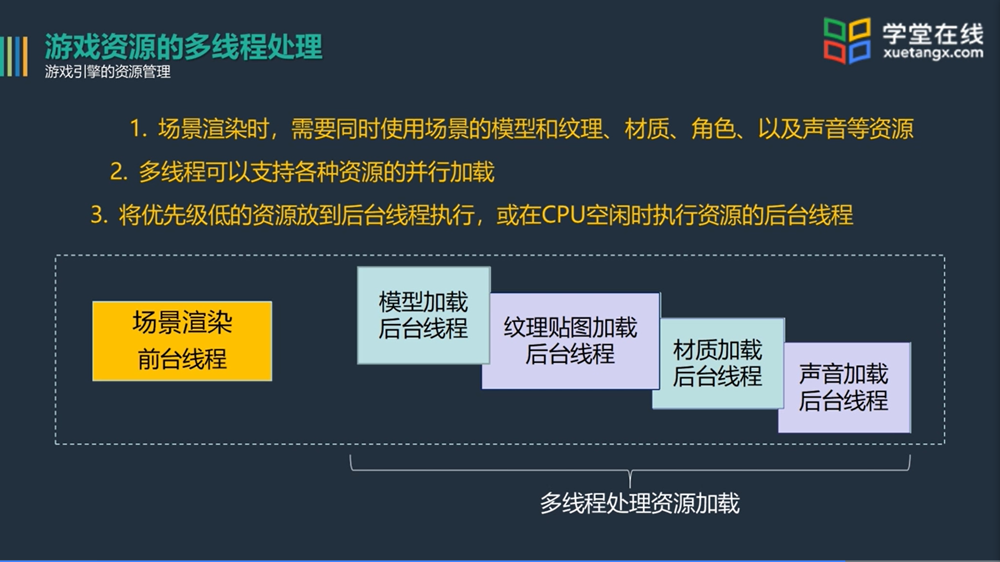
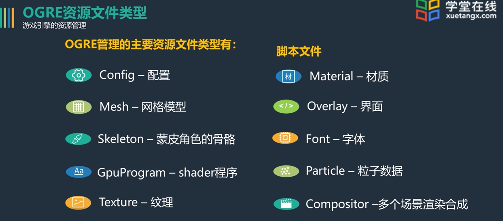
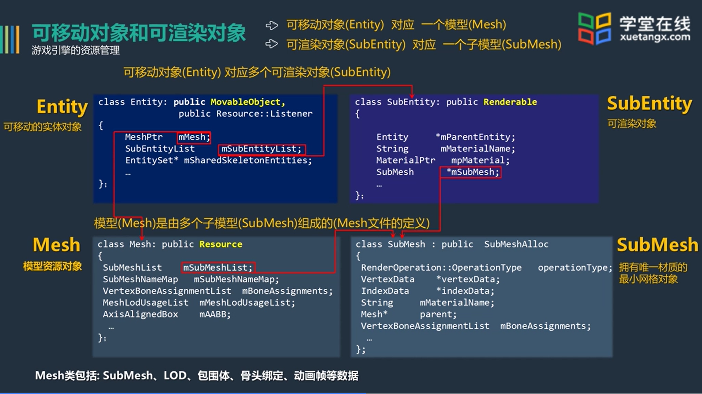
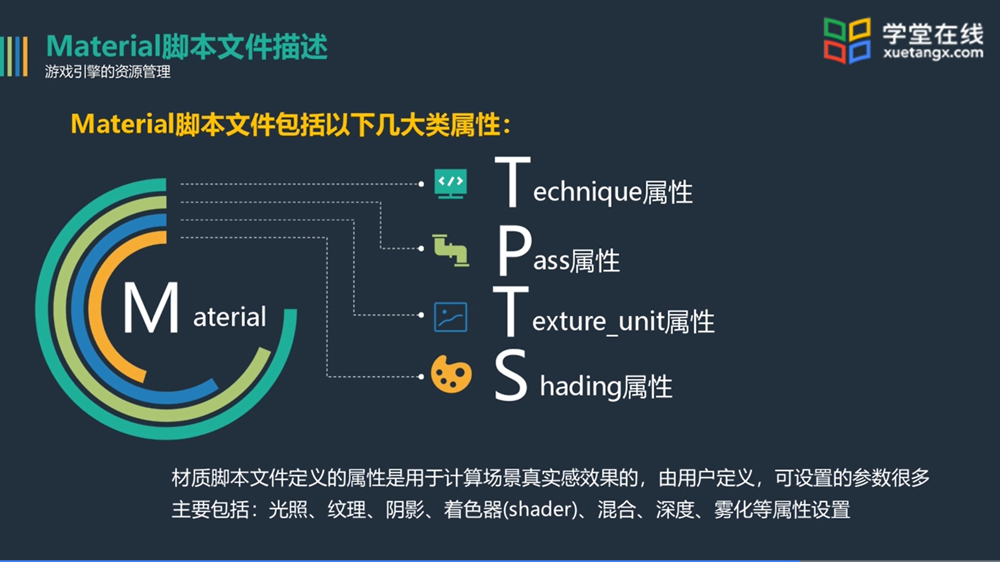

[toc]

# 3D游戏引擎设计[MOOC]

## 游戏引擎场景管理

### 八叉树场景管理

#### 概述

对于三维空间，使用立方体/长方体的结构，将其分为八个小立方体来进行管理

1.分割三维空间，把场景分成很多更小的部分，用层次树组织这些被分割的部分

2.八叉树就是把空间分成八等份，如果被分的部分填满了场景内容，或被分的部分没有场景内容，则不再分割；否则，继续分割，直到满足终止条件

3.被分割的空间可以用八叉树组织 

#### 分割八叉树算法

通过对结点区分为Empty和Full来记录结点，只有Full(F)的结点会被记录

#### 八叉树遍历方法

​	当镜头位置和方向确定后，场景的便利顺序就可以确定

​	渲染顺序可以由图形学的画家算法和Z-Buffer等方法进行

#### 优点：

1.由八叉树的分割算法可知，八叉树与BVH树一-样，具有包围体层次的特性，即顶层节点的立方体包含其所有子节点的立方体
2.八叉树方法适合于表示室外场景,当场景的局部在视见体里，只要判断哪些子立方体在视见体里即可,可以自顶向下分层判断

### BSP树算法

#### 概述

BSP树即Binary Space Partitioning，二叉空间分割。广泛用于第一人称视角类的游戏。

#### BSP树构建算法

##### 涉及的几何问题

**如何判断凸多面体**

暴力算法，对每个面根据定义进行判断

凸多面体定义：对于任意一个面，所有其他面都在该面的某一方向

**如何判断面片关系**

四种情况：前面，后面，相交，重叠

**如何判断顶点与面片的关系**

$Ax+By+Cz<>D$

##### 关键优点

​	在某个镜头下，对于凸多面体集，可以方便地判断哪些是可见面，哪些是要剔除的被遮挡面，因此可以快速地求出视见体中所有多边形面片遮挡关系，确定这些面片的渲染顺序，即BSP树的遍历路径。

​	这种处理方法类似于画家算法，即先确定视见体中面片的前后顺序，再从后向前或从前向后渲染。

#### 本节疑问

MINIMUMRELATION有什么用？什么时候会求不到最佳超平面？

## 本章作业疑问

场景中的可移动对象并非都可以被渲染？如何理解？

## 游戏引擎的资源管理

### 资源管理概述

**常见游戏资源：**

音频、视频、图片、模型、角色动画、字体、材质和纹理贴图等

**分类：**

用于场景的资源，用于游戏界面设计的资源、用于游戏整体效果的资源、配置引擎平台、资源或插件等的参数文件 

**主要任务**

资源管理：抽象并定义统一的资源处理方法，如：资源加载和卸载、资源调度等。

资源组织：根据各类资源的特性和使用方式，设计资源数据的内存组织。

**资源管理**

##### **文件管理**

文件加载与卸载、文件解析、文件格式转换、文件资源打包、文件资源传输

##### **内存管理**

内存分配、访问保证、内存释放

#####  **状态管理**

##### **调度算法**

##### **多线程处理**

### OGRE资源组织

#### OGRE资源组织概述

OGRE不支持菜单界面，需要第三方组件进行实现

OGRE主要是图形引擎，不包含声音、物理、AI、GUI等内容

#### **OGRE资源组织类及之间关系**

#### **Material脚本文件**

