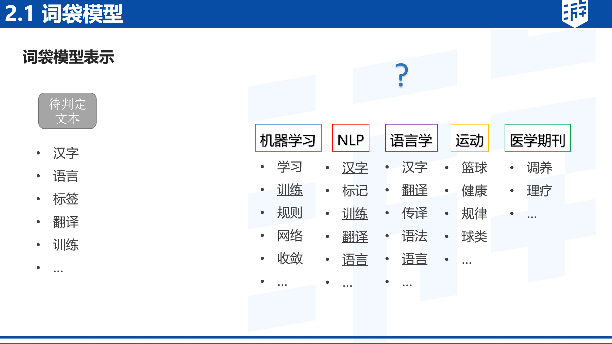

# 自然语言处理

# 第一节

## 概述

流程：

词法分析：词性标注，分词

句法分析：对句子中的词语语法功能进行分析

语义分析：词义消歧/指代消歧

知识图谱： 一个模拟“人认识世界”的数据存储方式

知识表示学习：一个将离散变量转为连续变量表示的一个方式

语言模型：用来计算一个句子的概率的模型

RNN->LSTM 

##  文本分类

#### 词袋模型 Bag of words

基于非常简单的文本特征获取

使用单词的子集，计算分类的概率

#### 特征工程

把文本转换成计算机可理解的格式，并封装足够用于分类的信息，即很强的特征表达能力

分为**文本预处理、特征提取、文本表示**

##### 文本预处理

1. 去掉干扰信息，数据清洗（re库做正则删除、替换、提取等文本处理）

2. 停用词(stop words)去除（语气词、中性词等），词根还原(stemming)（错别字纠正等）
3. 分词、词性筛选、短语识别、关键词抽取（jieba）

##### 特征提取

1. 特征级别

- Character，字：（中）

- Word，词：（中国）

- Phrase，短语：（中国人民银行）

- Ngram，N元字组或词组：（中国、人民），（人民、银行），（银行、发布）

2. 特征选择

   根据某个评价指标独立的对原始特征项进行评分排序，从中选择得分最高的一些特征项，过滤掉。

   常用的评价有文档频率，互信息、信息增益、$\chi^2$统计量等

##### 特征权重

# 第三节

## 序列标注

#### 中文分词

分词的Tag可以定义为{Begin,Middle,End,Single}

输入为一串序列，输出为每个元素进行标注

### 隐马尔可夫模型（HMM）

每个隐藏状态生成一个观察值，假设每个状态都依赖且仅依赖于他的上一个状态
$$
P(O, S)=P\left(s_{1}\right) \cdot \prod_{t=1}^{T} P\left(o_{t} | s_{t}\right) \cdot \prod_{t=2}^{T} P\left(s_{t} | s_{t-1}\right)
$$

##### 评估

给定模型u=(A,B,Pi)和一个观察值序列O，求解$p（O|u)$

已知模型概率，最简单的方法就是遍历，但是遍历会有线性爆炸问题 

使用动态规划

##### 解码

给定模型u=(A,B,Pi)和一个观察值序列O，找到一个状态序列S,使得$p（O|u，S)$最大

将评估的sum改为max

EM算法

### 最大熵马尔可夫（MEMM)

LSTM 加入输入、输出与**遗忘门**，避免RNN的梯度爆炸、梯度消失等问题

### 中文分词

#### 歧义切分难点

交集型切分

ABC AB与BC都可以同时成词，难以区分怎么切分

“乒乓球 拍卖 完 了”——“乒乓球拍 卖完了”

组合型切分歧义

AB A、B、AB同时为词

门把手弄坏了

多义组合型切分歧义

上个的前提下，语境下同时成立？

未登录词

#### 算法

正向最大匹配

# 第四节 

## 最大熵模型

$$
H(X)=\sum_{i=1}^{k} p\left(x=x_{i}\right) \log \frac{1}{p\left(x=x_{i}\right)}
$$

相对熵不满足交换律

## 拼写纠正

检测：字典

纠正：产生候选集，选择最为接近的可能

每个次都要产生候选集

每个候选集包括三部分（同音、同型及自身） 选择上下文最近的词

### Noisy Channel Intuition

原始单词->噪声通道（Noisy Channel）->还原（decoder）

本质需要的就是上下文的语言模型(language model)和词本身的接近距离(error model\channel model)

#### Damerau-Levenshtein 编辑距离

A technique for computer detection and correction of spelling errors

80% errors from Insertion\Deletion\substitution\Transposition

Also allow insertion of space or hyphen

80% errors are within deit distance 1

Almost all errors within edit distance 2

del[x,y] :count (xXy typed asX)
ins [X,y] :count (X typed asxy)
sub[x, y] :count (x typed asy)
trans [x,y] :count (xy typed as yx)

errors model:

收集常见错词得到单词sub\tran\del\ins等情况的混淆矩阵(confused matrix)

结合词频，可以得到p(x|y)

再结合上下文的语言模型求得$p(x_1|x_2)$的概率，相乘得到一个替换概率

又20%-40%的错误是真实词，无法通过词典检测

所以对于句子中的每个词生成候选词（如上由三部分组成）

依然是通过概率进行计算，真实词为自身的可能存在一个概率