[toc]

# 计算机视觉

时间：week1-11 Wed 2.pm

# 第一节

## Introduction

$\omega*=\mathop{argmax}\limits_{\omega\in\Omega}p(W|I)=\mathop{argmax}\limits_{\omega\in\Omega}p(I|W)p(W)$

目的是试图复现人类的视觉功能，包括了认知心理学等

参考书：《机器视觉》麻省理工

环境：OpenCV，Openmp，OpenCL/Cuda

# 第二节

## Background Review

冈萨雷斯4.3，数字信号处理

### 信号采样

样条

低通滤波->采样频率（采样定理）

> 如果周期函数 x(t) 不包含高于 B cps（次/秒）的频率，那么，一系列小于 1/(2B) 秒的x(t)函数值将会受到前一个周期的x(t)函数值影响。

两个参数，动态范围和量化阶数，级数越大，存储空间越大

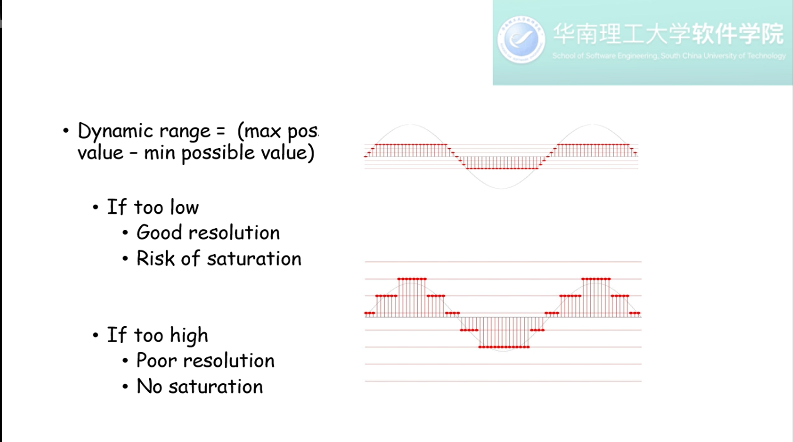

HDR=high Dynamic range\

当拥有一个高分辨率及高动态范围的图片时，映射到分辨率小的屏幕的方法是HDR的一个问题

硬件设备更新，提高区间呈现能力是另一个主要问题

### 图像处理

通常坐标表示为如下形式

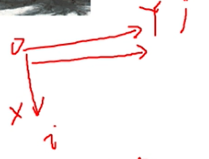

3.4->4.7

Mask

Convolution/Correlation Calculation

相关运算是相关位置使用的

卷积运算是镜像运算（上下左右镜像）的

自协方差：比较自身变化大小
$$
\operatorname{cov}(X, Y)=\mathrm{E}((X-\mu)(Y-\nu))=\mathrm{E}(X \cdot Y)-\mu \nu
$$
自相关：不同的两个信号变换大小（与上方的相关运算并没有太大联系！）是使用协方差除以标准差
$$
\rho_{X, Y}=\frac{\operatorname{cov}(X, Y)}{\sigma_{X} \sigma_{Y}}=\frac{E\left[\left(X-\mu_{X}\right)\left(Y-\mu_{Y}\right)\right]}{\sigma_{X} \sigma_{Y}}
$$

### 傅里叶变换

频谱图

DFT的时域与频域都是无限周期拓展的

傅里叶通常零点是能量最高的点，要将其平移到中间的位置

大部分能量在低频地区（图像大部分的地方变换较小），噪音通常为高频信号（变换突兀）

### 图像入门

A为系数分析矩阵，滤波结果

# 第三节 features

| 单词     | 中文      |
| -------- | --------- |
| Aperture | 光圈\孔径 |
## Overview

两种常见特征方法：局部（追踪）和全局（两张独立图像，m*n)

### 自相关方法 Auto-Correlation Method

#### 概念

即图像与自己的部分进行比较寻找特征的方法

#### 笔记

##### Weighted Summed Square Difference

$$
E_{\mathrm{WSSD}}(\boldsymbol{u})=\sum_{i} w\left(\boldsymbol{x}_{i}\right)\left[I_{1}\left(\boldsymbol{x}_{i}+\boldsymbol{u}\right)-I_{0}\left(\boldsymbol{x}_{i}\right)\right]^{2}
$$

##### auto-correlation

$$
E_{\mathrm{AC}}(\Delta \boldsymbol{u})=\sum_{i} w\left(\boldsymbol{x}_{i}\right)\left[I_{0}\left(\boldsymbol{x}_{i}+\Delta \boldsymbol{u}\right)-I_{0}\left(\boldsymbol{x}_{i}\right)\right]^{2}
$$

这是最直观的公式，$\mu$为偏差大小，图像处理中，$x$与$\mu$都是$(x_*,y_*)$的坐标,$\omega$为自相关系数

本质上就是寻找梯度大的地方（边角、轮廓），跟踪常用的思想

进行泰勒公式展开后得到
$$
E_{\mathrm{AC}}(\Delta \boldsymbol{u})=\Delta \boldsymbol{u}^{T} \boldsymbol{A} \Delta \boldsymbol{u}
$$
其中$A$为窗口函数
$$
A=w *\left[\begin{array}{cc}
I_{x}^{2} & I_{x} I_{y} \\
I_{x} I_{y} & I_{y}^{2}
\end{array}\right]
$$

### Uncertainty elipse corresponding

二维矩阵有两个特征值，分别代表矩阵在两个方向上的变换情况

使用特征值最小的点作为判断对象（我们希望特征点在所有方向上的变换都比较大），设定阈值作为特征点提取的依据。

#### 其他判断条件

使用矩阵的迹，使用比例 

## Harris Corner

### 角点检测

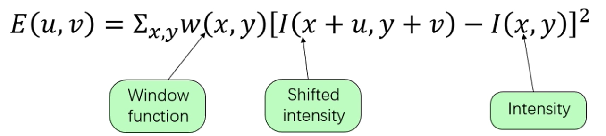

寻找角点的基础公式，角点即为各个方向上梯度都足够大的特征点（只看最小值点），此时的窗口为目标区域内的全1矩阵

角点检测存在三个问题：45度，窗口噪声，最小值点

### 具体方案

#### 窗口噪声

$$
w(x, y)=\exp \left(-\frac{\left(x^{2}+y^{2}\right)}{2 \sigma^{2}}\right)
$$

Harris Corner首先根据距离计算窗口函数（高斯分布），避免窗口大小造成的噪音问题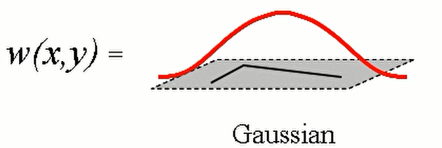

#### 45度角问题

使用梯度变换得到邻域信息，而不是简单的取八个方向的极小值
$$
\begin{array}{l}
\begin{aligned}
E(u, v) &=\Sigma_{x, y} w(x, y)[I(x+u, y+v)-I(x, y)]^{2} \\
&=\Sigma_{x, y} w(x, y)\left[I_{x} u+I_{y} v+O\left(u^{2}+v^{2}\right)\right]^{2}
\end{aligned} \\
E(u, v)=A u^{2}+2 C u v+B v^{2} \\
A=\sum_{x, y} w(x, y) I_{x}^{2}(x, y) \\
B=\sum_{x, y} w(x, y) I_{y}^{2}(x, y) \\
C=\sum_{x, y} w(x, y) I_{x}(x, y) I_{y}(x, y)
\end{array}
$$
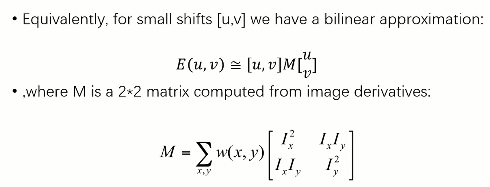

(图像的梯度计算使用窗口内的数据进行线性运算或其他方法，暂不进行更多考虑)

#### 最小值点

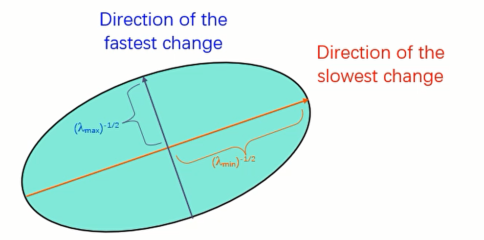

如图所示我们得到最大和最小的特征值

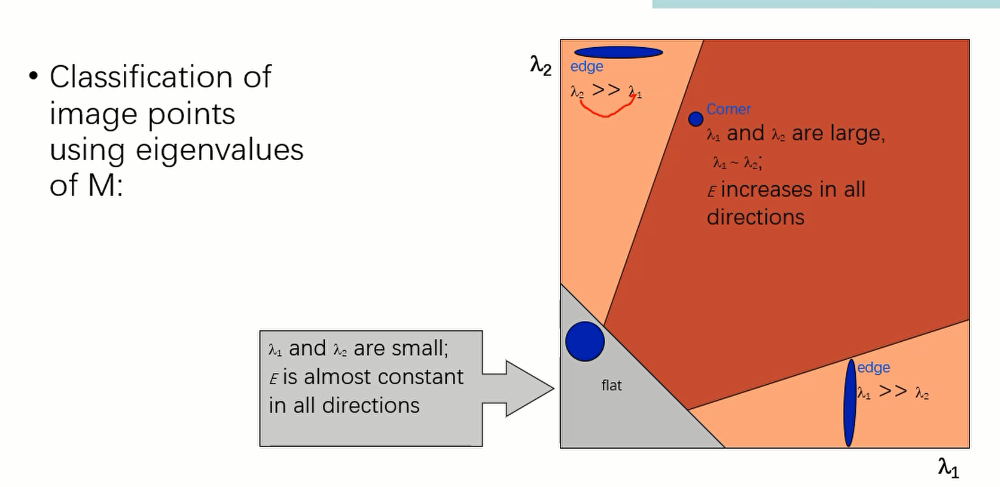
$$
R=\frac{\lambda_{1} \lambda_{2}}{\lambda_{1}+\lambda_{2}}=\frac{\operatorname{det} M}{\text { Trace } M}
$$
Harris Corner最后使用这样的公式来识别角点（R>threshold)

### 稳定性分析

旋转不变性

部分亮度不变性

不具有尺度不变性

## Matching （特征点匹配）

特征点两个特性：不变性，独特性

方法：穷举搜索、Hashing、最近邻

### 野点筛选

outliers（野点）：对计算或学习造成干扰的点

**自相关方法**

取两张图的对应点，当其领域的自相关结果大于某个阈值时抛弃

#### NNDR(nearest neighbor distance ratio)

关注第二相近匹配

1-NN/2-NN，筛除较小的点（独特性）（NN:nearest neighbor)

$NNDR=\frac{d1}{d2}=\frac{|D_A-D_B|}{|D_A-D_C}$

NNDR(nearest neighbor distance ratio) 跨图（候选对之间） 需要有距离对应

ANM(Adaptive non-maximal suppression) 也需要有距离？

问题成为了距离的定义（$L^p$距离)

聚类距离

Descriptors

基于形状

尺度抽象，非刚体形变

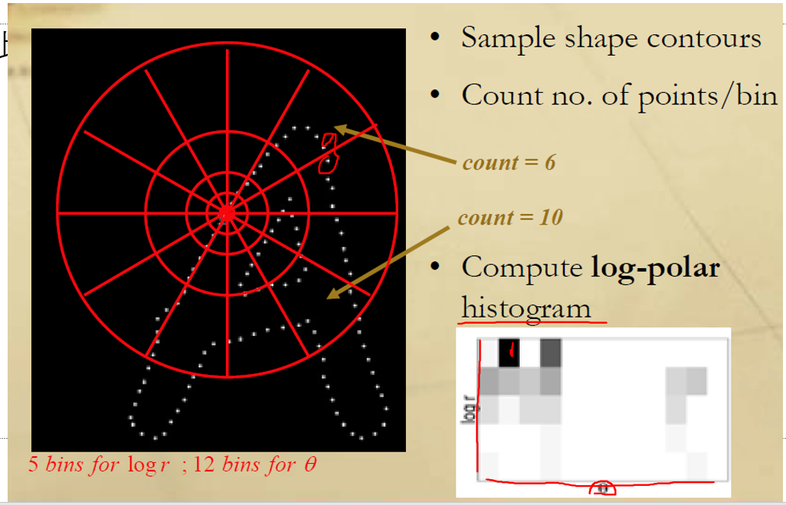

## 第四节

### SIFT

##### 步骤 

寻找特征点->确认特征点->确定方向->特征点描述

尺度不变

##### 分层预处理 

插值缩放，不同区域高斯核卷积

扩充两层识别极值点

##### 识别野点

低对比度、边缘

##### 特征表达方式

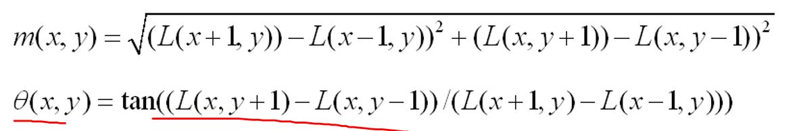

频率*m(x,y)最高的朝向是主方向

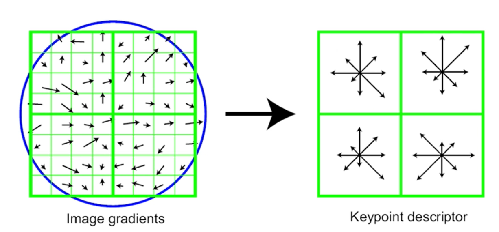

即如图的8\*8的图片分为四个4\*4的小结果

1.预处理筛对比度，设置阈值

2.邻域找极值点

3.泰勒展开确定极值点原坐标？

4.移除边缘点

# 5.1对象识别

## 识别难点

1.角度问题

2.光照问题（3d->2d)

3.遮挡

4.尺度

5.形变

​	旧：矩形

​	现：表面分析，三角网格图，运动仿真

6.背景混乱 background clutter

7.Intract class

## 建模

图像空间庞大，人体实际可识别的空间较小

熵

尺度问题：边缘轮廓建模（细尺度） 纹理建模（粗尺度） 模型变迁

 Classes of  Models

自顶向下（先有语义，产生式）和自底向上（得到语义，判别式）

# 3D问题

透视成像-投影-镜头

关键词：中心，焦距，成像面（传感器）大小

$tan\frac{\theta}{2}=\frac{W}{2f}$

焦距改变，视角改变（W通常为固定值[胶卷大小],35mm规格)

单位问题（课本6.20） 毫米到像素

投影

齐次坐标问题

 欧拉角的问题：旋转角度和计算顺序有关/变化不等于向量的连续移动

四元数

相机：

Center of projectiong(COP)

position\orientation\camera intrinsics

立体视觉

Disparity

根据偏差图片可以计算深度

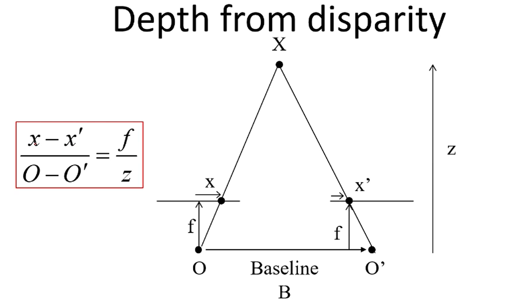

连接两个相机的光心得到baseline

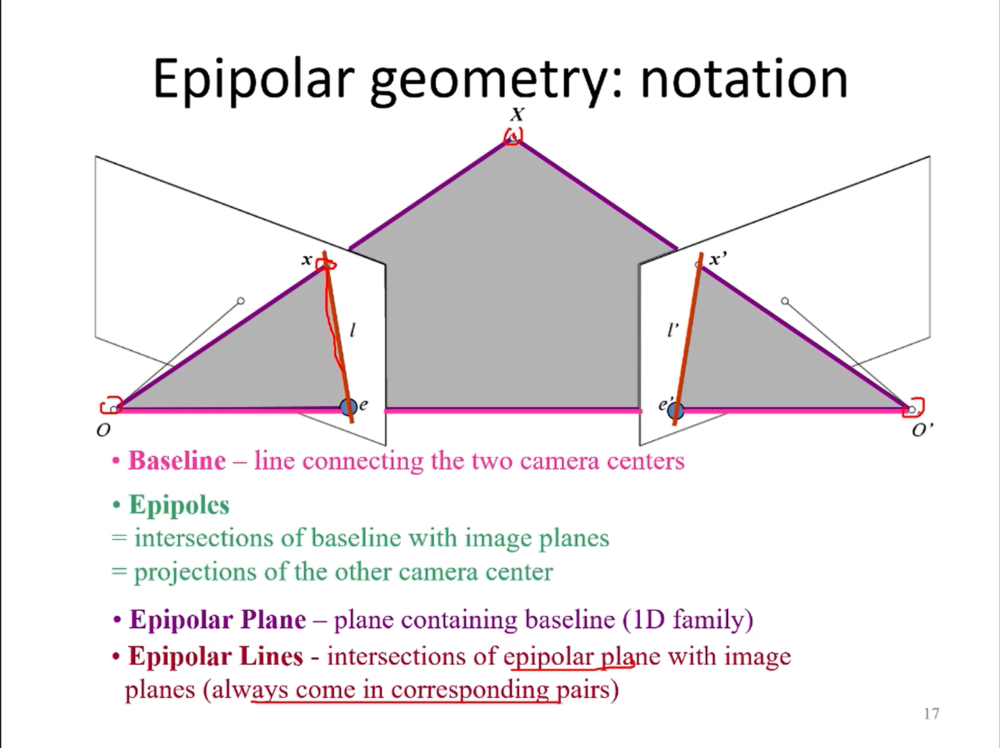

e为光心在另一个投影面的投影点，确定左图的一个点后，就可以以此确定该点在另一个平面可能出现的一条线

会聚光轴👆

本质矩阵

已知两个相机的校准，根据本质矩阵约束我们可以求得对应点

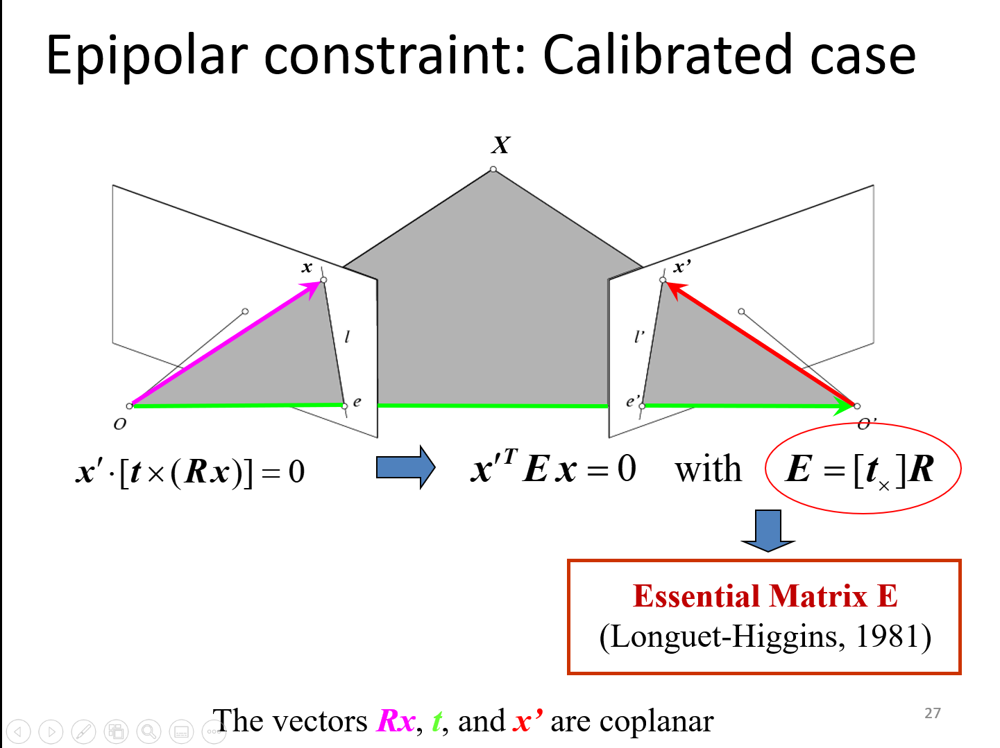

但一般情况为两个相机没有校准，需要先获得对应的特征点

而后联立计算，同时球的深度和相机内部参数，此时计算成为Fundamental Matrix

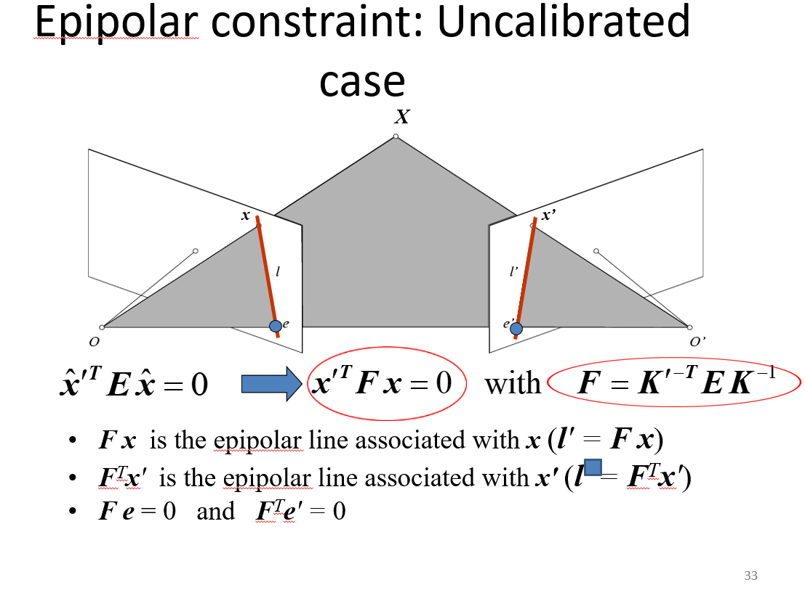

eight-point algorithm

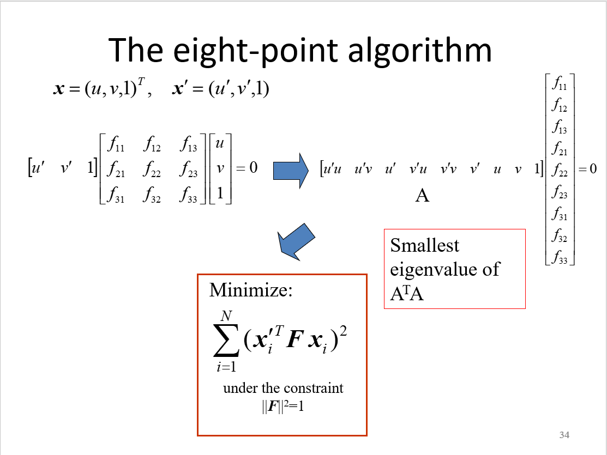

一定有误差，因为图形学仿射变换的坐标对应总是存在误差

手信，指落在相机前或者后

7.20

## SFM

计算每张图片的SIFT，对所有的图像两两匹配，基于双目视觉建立点云，对每张图像，根据匹配结果逐渐添加图像上的特征点到点云

